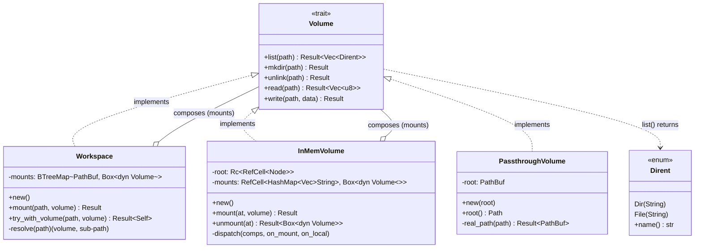

# Architecture

`cortex`는 작고 합성 가능한 가상 파일시스템입니다.

모든 것이 하나의 [`Volume`](src/volume/mod.rs) trait을 중심으로 구성되며, 더 큰 파일시스템은 여러 volume을 조합해서 만들어집니다.

## Components

### `Volume`

모든 backend가 구현하는 공통 인터페이스 trait입니다.

- `list(path)` — 디렉터리 항목을 [`Dirent`](src/volume/mod.rs) 목록으로 반환합니다.
- `mkdir` / `unlink` — 디렉터리 생성 / 항목 삭제.
- `read` / `write` — 파일 내용을 바이트로 읽고 씁니다.

### `Workspace`

유저에게 노출되는 **공개 진입점(public API)** 입니다. 자기 자신도 `Volume`을
구현하므로, 사용하는 쪽에서는 여러 backend가 합성되어 있다는 사실을 몰라도
하나의 파일시스템처럼 동일한 5개 연산으로 다룰 수 있습니다.

**`Workspace`는 스스로 데이터를 저장하지 않고, 다른 volume들의 합성으로만 이루어집니다.
** 구체적으로:

- 내부적으로 `mounts: BTreeMap<PathBuf, Box<dyn Volume>>`, 즉 *마운트 지점 경로 → 해당 지점을 담당하는 volume* 매핑만 들고 있습니다.
- `Workspace::new()`는 비어 있는 workspace가 아니라, 루트(`""`)에 [`InMemVolume`](src/volume/mem.rs)이 fallback으로 마운트된 상태로 시작합니다. 즉 아무 데도 매칭되지 않는 경로는 항상 이 루트 volume이 처리합니다.
- `mount(path, volume)` / `try_with_volume(path, volume)`로 특정 경로에 다른 volume을 얹습니다. `mount`은 이미 마운트된 지점이면 `AlreadyExists`로 실패하고, `try_with_volume`은 builder 스타일로 기존 것을 덮어씁니다.
- 요청이 들어오면 `resolve(path)`가 **최장 접두사 매칭(longest-prefix match)** 으로 그 경로를 소유한 volume을 찾습니다. `PathBuf`의 component 단위 `Ord` 덕분에, 요청의 접두사가 되는 키들 중 가장 긴 것이 곧 사전순으로 가장 큰 키이므로, 역방향 range scan 한 번으로 찾을 수 있습니다.
- 그 뒤 요청 경로를 매칭된 마운트 지점 기준으로 다시 계산(re-base)해서 해당 volume에 그대로 위임합니다.

따라서 `Workspace`가 하는 일은 실제 저장이 아니라 **경로 라우팅**입니다.
예를 들어 루트는 인메모리, `/disk`는 [`PassthroughVolume`](src/volume/passthrough.rs)로 두면, `/disk` 아래 경로는 실제 디스크로, 나머지는 메모리로 자연스럽게 분기됩니다.

### `InMemVolume`

인메모리 트리 backend입니다. 실제로 파일에 기록되지는 않으며, 가상의 volume을 만들기에 적합합니다.

### `PassthroughVolume`

디스크상의 `root` 디렉터리에 고정되어 모든 연산을 `std::fs`로 그대로 통과시키는 backend입니다.

## 설계 원칙

`Volume` trait은 **FUSE와 최대한 1:1로 대응**되도록 설계합니다. 즉 trait의 각 연산이 FUSE 콜백과 곧바로 매핑될 수 있어야 합니다. 이 원칙은 두 가지 이점을 줍니다.

1. **검증된 레퍼런스**: FUSE는 이미 파일시스템을 인터페이스로 추상화해 둔 사례이므로, trait을 어떤 연산으로 구성할지 결정할 때 좋은 기준이 됩니다.
2. **얇은 어댑터로 노출**: 각 연산이 FUSE 콜백에 대응하는 만큼, 어떤 `Volume` 구현이든 얇은 어댑터만 얹어 FUSE 파일시스템으로 노출할 수 있습니다. WebDAV 등 다른 API도 같은 방식으로 감싸집니다.

## 연동 계획

- **WebDAV API 노출** — `Workspace`를 WebDAV API로 감싸서 외부 클라이언트가 네트워크 파일시스템처럼 마운트·접근할 수 있게 할 예정입니다. `Workspace` 자체가 `Volume`이므로, WebDAV 서버는 그 5개 연산을 HTTP 메서드로 중계하는 얇은 계층이 됩니다.
- **agent 연동 (virtiofs)** — agent가 `Workspace`를 사용하는 경로로, [libkrun](https://github.com/containers/libkrun)의 `Filesystem`과 연동하면 virtiofs를 통해 `Workspace`를 게스트 VM 안에 마운트할 수 있습니다. 이렇게 하면 agent는 격리된 환경에서 표준 파일시스템 인터페이스로 workspace에 접근합니다. 다만 이를 위해서는 프로세스 fork 등 실행 모델 관련 작업이 필요하며, 구체적인 방법은 추후 조사해서 정리할 예정입니다.

## Hook

hook은 현재 `Workspace` struct에 구현되면 되는 것으로 설계되어 있습니다.