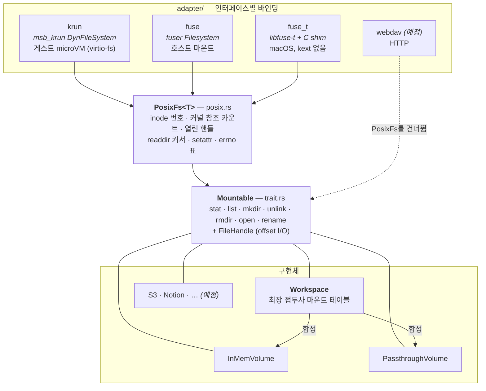

# Architecture

`cortex`는 작고 합성 가능한 가상 파일시스템입니다.

한 문장으로 요약하면 **"경로로 주소를 매기는 아무 저장소든 진짜 파일시스템으로 노출한다"**
입니다. 저장소 쪽은 [`Mountable`](src/mountable/trait.rs) trait 하나로 표현하고,
노출 쪽은 인터페이스마다 얇은 어댑터를 하나씩 얹습니다.

## 계층

세 개의 층이 쌓여 있고, 모듈 트리가 그 모양을 그대로 따릅니다.



점선이 이 구조에서 가장 중요한 부분입니다. **`PosixFs`는 공통 기반이 아니라
"커널은 파일을 번호로 지칭한다"는 사실 때문에 필요한 번역 계층**입니다. 모든 동작이
경로를 들고 오는 인터페이스(WebDAV의 HTTP 메서드, 라이브러리 호출)는 그 번역이
필요 없으므로 `Mountable`에 곧바로 닿고, `PosixFs`를 지나지 않습니다.

## `Mountable` — 저장소 계약

[`src/mountable/trait.rs`](src/mountable/trait.rs)

backend가 구현하는 유일한 인터페이스입니다. **namespace/metadata 평면**은 경로로
주소를 매기고, **data 평면**은 상태를 가진 핸들을 거칩니다.

| 연산 | 역할 |
| --- | --- |
| `stat(path)` | 항목 하나의 메타데이터 ([`Stat`](src/stat.rs)) — 파일·디렉터리 모두 |
| `list(path)` | 직속 자식 목록 ([`Dirent`](src/mountable/trait.rs)) |
| `mkdir` / `unlink` / `rmdir` | 디렉터리 생성, 파일 삭제, 빈 디렉터리 삭제 |
| `open(path, options)` | `(Handle, Stat)` — 핸들과 그 시점의 메타데이터를 함께 |
| `rename(from, to)` | 이동. **유일하게 기본 구현이 있는 연산** |

설계 판단이 들어간 지점들:

- **`unlink`과 `rmdir`이 갈라져 있는 이유** — 파일시스템은 재귀 삭제를 하지 않습니다.
  커널은 `rm -rf`를 `list` + 파일별 `unlink` + 마지막 `rmdir`로 분해해서 보냅니다.
  여기서 조용히 서브트리를 지우는 backend는 실수로만 도달됩니다.
- **`open`이 `Stat`을 함께 돌려주는 이유** — FUSE `create`는 속성과 핸들을 한 메시지로
  답해야 합니다. 따로 `stat`을 부르면 왕복이 한 번 더 늘고, 그 사이에 항목이 교체될
  창이 생깁니다.
- **`OpenOptions`가 `open`에 실려 가는 이유** — `create_new`(`O_EXCL`)와 `truncate`는
  backend만 지킬 수 있는 원자성 요구입니다. "stat 해보고 없으면 만든다"는 계약이 아니라
  레이스입니다.
- **`rename`만 기본 구현(`ReadOnly`)이 있는 이유** — 대부분의 backend는 읽기 전용이고,
  쓸 수 없는 저장소가 여기서 할 말은 "안 된다" 말고 없습니다. 읽기 전용 backend가
  코드 한 줄도 쓰지 않게 됩니다.
- **`rename`에 flags가 없는 이유** — `RENAME_NOREPLACE`/`RENAME_EXCHANGE`는 세 바인딩 중
  둘에는 도달하는데 libfuse-t의 `rename`에는 flags 인자 자체가 없습니다. 어디서나
  지킬 수 없는 계약은 계약이 아니므로, flags를 받는 바인딩이 `EINVAL`로 답합니다.

### 곁딸린 타입들

- **[`Stat`](src/stat.rs)** — `kind`/`size`만 필수이고 타임스탬프·`etag`·`version`은
  `Option`입니다. 로컬 파일, S3 객체, Notion 페이지가 노출하는 필드 집합이 서로 다르고,
  그 차이를 타입이 인정합니다.
- **`Dirent::stat: Option<Stat>`** — 목록이 **공짜로** 메타데이터를 얻었을 때만 채웁니다.
  객체 스토어나 문서 API는 같은 응답에 크기·시각을 실어 주므로 채우는 게 무료이고
  N+1 왕복(`readdirplus`, `PROPFIND Depth: 1`)을 없앱니다. 로컬 디렉터리 읽기는 이름과
  `d_type`만 주므로 여기서 `Some`은 `ls`가 요청하지도 않은 항목별 `lstat`을 뜻합니다.
- **[`FileHandle`](src/mountable/trait.rs) / `FileExt`** — 데이터 평면은 커서가 아니라
  **offset 주소 지정**입니다. FUSE에서 위치를 소유하는 건 게스트 커널이고 매 호출마다
  절대 offset이 실려 오며, 동시 독자들이 별도 커서를 필요로 하지 않습니다. `FileExt`가
  따로 있는 것은 unix의 `read_at`/`write_at`과 windows의 `seek_read`/`seek_write`를
  하나의 이름으로 묶기 위해서입니다.
- **`DynMountable`** — `Mountable`은 연관 타입 `Handle`을 가지므로 `dyn Mountable`이
  불법입니다. 이종 마운트 테이블을 담으려면 핸들을 `Box<dyn FileHandle>`로 지워야 하고,
  blanket impl이 그걸 자동으로 해 줍니다.
- **`impl<T: Mountable> Mountable for Arc<T>`** — 공유된 backend도 backend입니다.
  각 소비자가 backend를 **값으로** 받고 돌려주지 않기 때문에(`PosixFs::new`에 접근자가
  없고 `Workspace::mount`는 받은 걸 박싱합니다), 이게 없으면 하나의 저장소가 정확히
  하나의 소비자만 먹입니다. 즉 같은 workspace를 에이전트에게는 호스트 마운트로,
  사람에게는 HTTP로 동시에 내보낼 수 없습니다. 핸들 타입이 그대로 통과하므로 공유
  비용은 데이터 평면에서 0입니다.

## `Workspace` — 여러 backend를 한 파일시스템으로

[`src/workspace.rs`](src/workspace.rs)

`Workspace`는 **스스로 데이터를 저장하지 않습니다.** 들고 있는 건
`BTreeMap<PathBuf, Box<dyn DynMountable>>`, 즉 *마운트 지점 → 그 지점을 담당하는 backend*
매핑뿐입니다. 자기 자신도 `Mountable`이라(핸들이 `Box<dyn FileHandle>`) 다른 workspace
안에 마운트될 수도 있고, 단일 backend와 똑같은 어댑터로 구동됩니다.

```rust
let ws = Workspace::new()
    .try_with_mount("scratch", InMemVolume::new())?
    .try_with_mount("repo", PassthroughVolume::new("/Users/me/project"))?;
```

- `Workspace::new()`는 **마운트가 하나도 없는 상태**로 시작합니다. 루트는 그래도
  디렉터리입니다 — 갓 마운트된 tmpfs처럼 비어 있는 디렉터리라서, 빈 workspace를 먼저
  마운트해 두고 나중에 채울 수 있습니다.
- `mount`은 이미 점유된 지점이면 `AlreadyExists`, `try_with_mount`은 builder 스타일로
  덮어씁니다. `unmount`은 떼어낸 backend를 돌려줍니다.

### 라우팅: 최장 접두사 = 역방향 range scan 한 번

`PathBuf`의 `Ord`가 component 단위라는 성질이 자료구조 선택을 결정합니다. 요청의
접두사가 되는 키들 중 **가장 긴 것이 곧 사전순으로 가장 큰 것**이므로, `route`는
`range(..=key).rev()`에서 첫 번째 접두사를 찾으면 끝입니다. 같은 접두사를 공유하는
키들은 맵에서 **연속한 구간**을 이루고(`["a"] < ["a","b"] < ["a","z"] < ["b"]`),
`ab`같은 형제가 그 사이에 끼어들 수 없습니다. 그래서 자손 마운트 열거도 스캔이 아니라
구간 하나입니다.

### 합성 디렉터리 (synthesized directory)

`/repo`와 `/scratch`에만 마운트가 있을 때, 루트 `/`는 어느 backend도 소유하지 않습니다.
그런데 커널이 마운트 직후 가장 먼저 하는 일은 루트의 `getattr`입니다. 여기서
`NotFound`를 답하면 마운트가 그 자리에서 실패합니다 — **다중 소스 workspace가 마운트조차
되지 않는** 상태였고, 이 계층이 그걸 고칩니다.

`Workspace`는 마운트를 하나 이상 품고 있는 경로를 **디렉터리로 합성**해서 답합니다.
관련 판단:

- **합성 디렉터리는 읽기 전용(`ReadOnly`)입니다.** 그 경로를 소유한 backend가 없으니
  거기에 파일을 만들면 어디에 저장될지 정의되지 않습니다. `NotFound`가 아닌 이유는,
  `ls`로 보이는 디렉터리에 "없다"고 답하면 도구들이 무한히 재시도하기 때문입니다.
- **합성 디렉터리의 mtime은 생성 시점에 고정**됩니다(`born`). 매 `stat`마다
  `SystemTime::now()`를 답하면 영원히 방금 수정된 것으로 보이고, `AUTO_INVAL_DATA`를
  협상한 게스트는 정확히 그 필드를 보고 캐시된 페이지를 버릴지 정하므로 캐시가 영구
  무효화됩니다. 그냥 비워 두는 것도 답이 아닙니다 — UNIX epoch로 폴백되고
  `find -newer`, `make`, `rsync`가 모두 그 값을 읽습니다.
- **`list`는 마운트에서 유도한 이름을 먼저(정렬해서), backend가 준 이름을 나중에**
  냅니다. backend 쪽 변동이 진행 중인 readdir에서 마운트 지점의 위치를 밀어내지 못하게
  하기 위해서입니다.

### 경계를 넘는 `rename`

`rename`은 `Workspace`가 라우팅 판단을 하는 대표적인 지점입니다.

| 상황 | 답 |
| --- | --- |
| 양쪽이 같은 마운트 안 | 해당 backend에 위임 |
| 양쪽이 서로 다른 마운트 | `CrossDevice` (`EXDEV`) |
| 어느 쪽이든 마운트 테이블이 소유한 경로(마운트 지점 자체 또는 합성 디렉터리) | `ReadOnly` |
| 출발지에 마운트가 없음 | `NotFound` |

`EXDEV`는 실패가 아니라 **지시**입니다. `mv`는 수십 년간 그것을 "복사한 뒤 삭제"로
읽어 왔고, `rsync`와 에디터들도 같은 폴백을 구현합니다. 그래서 정확히 이 이름을 대는
것이 곧 경계를 넘는 `mv`를 **성공시키는** 방법입니다. 더 뭉갠 에러는 같은 요청을 사용자가
손으로 우회해야 하는 단단한 실패로 만듭니다.

커널이 실제 마운트 두 개 사이의 이동은 스스로 처리하지만, `Workspace`의 내부 마운트
테이블은 커널이 볼 수 없습니다. 그래서 커널은 물어보고, 이 계층이 답해야 합니다.

## `PosixFs<T>` — 커널을 위한 번역

[`src/mountable/posix.rs`](src/mountable/posix.rs)

경로로 주소를 매기는 `Mountable`과, 파일을 **번호**로 지칭하는 커널 사이의 간극을
메웁니다. FUSE나 `msb_krun`에 대한 결합은 전혀 없고, 구체 바인딩이 이걸 구동합니다.

들고 있는 것:

- **`InodeTable`** — `inode → (path, 커널 참조 카운트)` 정방향 맵과 `path → inode` 역방향
  맵. 같은 경로를 다시 `lookup`하면 같은 번호를 재사용합니다(그러지 않으면 `st_ino`
  기반 중복 제거가 깨집니다).
- **`HandleTable`** — `fh → Arc<T::Handle>`. backend의 값비싼 준비(인증, 경로 해석,
  range reader, multipart 업로드)를 `open` 때 한 번 하고 핸들 수명 동안 분할 상환합니다.

세 바인딩이 **정확히 똑같이 지켜야 하는** 규약들이 여기 모여 있습니다:

- **readdir 커서** — offset은 목록에서의 1-based 위치이고, 커널은 마지막으로 소비한
  offset을 인용해서 이어받습니다. `.`과 `..`이 앞의 두 칸이며, `..`은 이 디렉터리의
  inode를 재사용합니다(실제 부모를 찾는 것은 `lookup`으로 하는 순회에 아무 이득이 없음).
- **eviction과 rekey의 구분** — `unlink`/`rmdir`은 항목이 **사라졌고** 커널이 그 번호를
  다시 인용하지 않을 것이므로 매핑을 버려도 됩니다. 그런데 `rename`은 **살아 있는 객체를
  옮기고**, 커널은 자기 dentry 캐시를 갱신한 뒤 **같은 inode를 계속 인용**합니다.
  그래서 여기서는 버리는 게 아니라 `rekey_subtree`로 **경로를 다시 씁니다** — 버리면
  다음 `getattr`이 `ESTALE`이 됩니다.
- **`evict_path`가 정방향 항목을 남기는 이유** — 커널은 unlink됐지만 열려 있는 파일의
  참조를 아직 들고 있을 수 있고, POSIX는 살아남은 디스크립터로 하는 `fstat`이 계속
  동작하기를 요구합니다. 지우면 거의 모든 tempfile 구현이 깨집니다.
- **`setattr`은 `size`만 실행**하고 mode/소유권/타임스탬프는 받아서 버립니다. 저장하는
  곳이 없고 속성 정책이 고정 권한 비트를 보고합니다. 실패로 답하면 `cp -p`, `tar -x`,
  `touch`가 아무 이득 없이 깨집니다.
- **`FLUSH`와 `RELEASE`의 구분** — FLUSH는 매 `close()`마다, RELEASE는 마지막 것에만
  옵니다. FLUSH에서 확정해 버리면 `dup`된 디스크립터로 아직 들어오는 쓰기를 끊습니다.
- **errno 표** — 개념(`CortexError`)은 공유하고 **숫자는 바인딩별**입니다. 게스트는 항상
  Linux이므로 krun 바인딩은 Linux 번호를 하드코딩하고, 호스트 바인딩은 호스트의
  `libc`를 씁니다.

`PosixFs`가 부재해도 되는 계층이라는 점은 코드에도 나타납니다 — 커널 바인딩이 하나도
켜져 있지 않으면 이 모듈의 항목 중 아무것도 읽히지 않습니다.

## `adapter/*` — 인터페이스별 바인딩

[`src/mountable/adapter/`](src/mountable/adapter/)

바인딩은 **번역만** 합니다. 인터페이스의 인자를 해독하고, 공유 연산을 호출하고, 답을
인코딩합니다. 스스로 정하는 건 두 가지뿐입니다: 소비자가 기대하는 errno 번호 체계와,
채워야 하는 구체 속성 타입.

바인딩은 trait impl이므로 **모듈 선언이 유일한 진입점**입니다. 내보내는 것은 각 바인딩의
**호출부(call surface)** — 프로그램이 그 인터페이스 앞에 파일시스템을 세우기 위해 들고
있는 타입입니다.

| 모듈 | feature | 상대 인터페이스 | 호출부 |
| --- | --- | --- | --- |
| [`krun`](src/mountable/adapter/krun.rs) | `krun` | `msb_krun`의 `DynFileSystem` (게스트 virtio-fs) | 없음 — `msb_krun`의 `VmBuilder::fs(..).custom(..)`이 그 역할 |
| [`fuse`](src/mountable/adapter/fuse.rs) | `fuse` | `fuser`의 `Filesystem` (호스트 FUSE) | `CortexMount` (RAII, drop 시 unmount) |
| [`fuse_t`](src/mountable/adapter/fuse_t.rs) | `fuse-t` | libfuse-t lowlevel API + C shim | `FuseTMount` |
| `webdav` *(예정)* | `webdav` | HTTP | `tower::Service` 핸들러 |

### `fuse`와 `fuse_t`가 따로인 이유

같은 인터페이스의 두 방언이 아니라 **세션을 누가 구동하는지가 다릅니다.** `fuser`는
`fuse_mount`가 준 fd에서 FUSE 프로토콜을 직접 읽습니다 — 그 fd가 macFUSE의 실제 디바이스일
때는 동작합니다. FUSE-T의 fd는 자기 `go-nfsv4` 헬퍼로 가는 소켓이고, libfuse-t의 루프가
자기를 구동해 주기를 기대합니다. 외부 프로토콜 리더에 넘기면 INIT 핸드셰이크는 끝나고
탐침 두 개가 도착한 다음 헬퍼가 연결을 끊고 마운트가 나타나지 않습니다. (실측했고,
cortex 탓이 아님도 확인했습니다 — 하드코딩된 `fuser` 파일시스템도 똑같이 실패합니다.)
대가로 FUSE-T는 커널 확장이 필요 없고, macFUSE는 Apple Silicon에서 reduced-security
부팅을 요구하는 kext입니다.

### C shim이 있는 이유

[`contrib/fuse_t/shim.c`](contrib/fuse_t/shim.c) — `fuse_lowlevel_ops`는 `__APPLE__`
조건부 멤버를 포함해 함수 포인터가 약 50개, `fuse_file_info`는 비트필드, `fuse_entry_param`은
호스트 `struct stat`을 품고 있습니다. Rust 쪽에서 레이아웃을 틀리면 컴파일 에러가 아니라
조용한 메모리 손상입니다. 그래서 C가 그 전부를 소유하고, 우리가 설계한 평평한 vtable만
노출합니다.

## 구현체

- **[`InMemVolume`](src/mountable/impl/inmem.rs)** — 인메모리 트리. 모든 링크가
  `Arc<Mutex<..>>` 뒤에 있어서 `&self`로 하나의 저장소를 공유하고 `Send + Sync`를 만족합니다.
  파일의 mtime이 **노드가 아니라 바디에 있는** 것이 의도된 비대칭입니다: `InMemHandle`은
  노드로 갈 경로가 없고, 바이트와 mtime이 같은 락 아래 있어야 관찰자가 새 바이트를 옛
  mtime과 짝지을 수 없습니다.
- **[`PassthroughVolume`](src/mountable/impl/passthrough.rs)** — 디스크의 `root`에 고정되어
  모든 연산을 `std::fs`로 통과시킵니다. 선행 `/`와 `.`은 무시하고 `..`(및 OS prefix)는
  거절해서 요청이 root를 벗어날 수 없습니다. `std::fs::File`이 그대로 `FileHandle`이라
  핸들 구현이 필요 없습니다.
- **S3 · Notion 등** *(예정)* — 이들이 `Stat`의 필드 대부분을 `Option`으로 만들고
  `Dirent::stat`을 존재하게 한 이유입니다.

## 설계 원칙

1. **`Mountable`은 FUSE와 최대한 1:1로 대응한다.** FUSE는 이미 검증된 파일시스템
   추상화이므로 trait을 어떤 연산으로 구성할지 정하는 좋은 기준이고, 각 연산이 콜백에
   대응하는 만큼 어떤 구현이든 얇은 어댑터만으로 노출됩니다.
2. **errno는 정밀하게 고른다.** `ENOSYS`는 그 연산을 **마운트 전체**에서 비활성화하므로,
   읽기 전용 backend 하나가 `Unsupported`로 답하면 옆에 있는 쓰기 가능한 backend들의
   쓰기까지 함께 앗아갑니다. 그래서 `ReadOnly`와 `CrossDevice`가 별도 변형으로 있습니다.
   `EACCES`와 `EIO`를 합치면 읽을 수 없는 파일 하나에 `find`/`rsync`/`tar`의 순회 전체를
   잃습니다.
3. **기본값은 의존성 0이다.** 크레이트의 자체 계층(`Mountable`, `Workspace`, inode 부기)은
   의존성이 전혀 필요 없고, 인터페이스 바인딩은 각각 무거운 걸 하나씩 들고 옵니다.
   하나라도 기본으로 켜면 모든 소비자에게 그 값을 청구합니다.
4. **계층의 책임 경계** — cortex는 **저장소의 모양과 파일시스템 프로토콜**을 압니다.
   벤더, 크리덴셜, 에이전트, 세션은 알지 못합니다. 그것들은 위 계층의 몫입니다.

## Feature

| feature | 내용 | 딸려 오는 크레이트 |
| --- | --- | --- |
| `default = []` | 크레이트의 자체 계층만 | **0** |
| `fuse-t` | `dep:libc` | **1** |
| `fuse` | `dep:fuser`, `dep:libc` | **34** |
| `krun` | `dep:msb_krun`, `dep:libc`, `dep:tempfile` | **65** (VMM 트리 전체) |
| `fuse-no-mount` | `fuse` + `fuser/macos-no-mount` — 마운트 제공자 없이 컴파일·테스트 | 34 |

실측한 크레이트 수가 `default = []`의 근거입니다. HTTP로 파일만 서빙하려는 소비자가
하이퍼바이저를 컴파일할 이유가 없습니다. (측정 명령은 `Cargo.toml`의 `[features]` 주석에
적혀 있습니다. normal 엣지만 세므로 무조건 딸려 오는 build-dep `cc`/`pkg-config`는
제외됩니다.)

`fuse`와 `fuse-t`가 **서로 독립**이라 어떤 기본 조합으로도 모든 바인딩을 한 번에 덮을 수
없습니다. 그래서 전체 커버리지는 처음부터 스윕이고, 명령은
[`Cargo.toml`](Cargo.toml)의 `[features]` 주석에 적혀 있습니다.

macOS에서 `fuse`를 빌드하려면 libfuse 제공자가 필요합니다. FUSE-T는 `fuse.pc`가 아니라
`fuse-t.pc`를 설치하므로 `contrib/pkgconfig`의 shim을 가리켜야 합니다:

```sh
PKG_CONFIG_PATH="$PWD/contrib/pkgconfig:/usr/local/lib/pkgconfig" cargo build --features fuse
```

Linux는 제공자가 필요 없습니다 — `fuser`가 `/dev/fuse`를 직접 엽니다.

## 소비 체인

의존 방향은 `agent-k → ailoy → cortex → microsandbox`이고, microsandbox가 cortex에
의존하는 일은 없습니다.

하나의 workspace로 들어가는 문이 세 개 있습니다.

| 문 | 누가 쓰는가 | 경로 |
| --- | --- | --- |
| **`File`** *(cortex PR 2)* | 코드 안에서 직접 | `Mountable` 직접 |
| **FUSE 마운트** | 에이전트 (격리된 게스트 또는 호스트) | `adapter/krun`, `adapter/fuse`, `adapter/fuse_t` |
| **WebDAV** *(예정)* | 사람 사용자 | `adapter/webdav` |

cortex가 파는 것은 **마운트**이지 직접적인 라이브러리 호출이 아닙니다. ailoy가 cortex의
FUSE 기능을 받아 실제로 마운트해 사용할 수 있게 하고, agent-k는 ailoy를 거칩니다.
WebDAV는 agent-k가 의존성으로 직접 들고 씁니다.

**같은 workspace를 두 문으로 동시에** 내보내려면 `Arc<Workspace>`입니다 — 위의
`Mountable for Arc<T>`가 그걸 위해 있습니다. 단, 한 프로세스 안에서만입니다.
`adapter/krun`은 그 두 문 중 하나가 될 수 없는데, `vm.enter()`가 돌아오지 않기 때문입니다
(게스트가 종료되면 VMM이 `_exit()`를 호출해 프로세스 전체를 죽입니다 — 상위 libkrun에서
물려받은 성질이고 `ExitHandle::trigger()`도 `_exit()`으로 끝납니다).

## 검증

| 층 | 방법 |
| --- | --- |
| 단위 | `cargo test --lib` — 기본 63개, `--all-features` 79개. 테스트는 `#[path]`로 `*_tests.rs` 형제 파일에 두면서 private 항목 접근을 유지합니다 |
| 조합 | feature 조합 7개 스윕 — 명령은 `Cargo.toml`의 `[features]` 주석에 |
| 실제 마운트 | [`tests/host_mount.rs`](tests/host_mount.rs) — `#[ignore]`, `--test-threads=1` **필수**. FUSE-T의 `go-nfsv4` 헬퍼가 동시 마운트 3개에서 멈춥니다 |
| 실제 게스트 | [`src/bin/apply_krun.rs`](src/bin/apply_krun.rs) — microVM을 띄워 게스트 안에서 읽고 씁니다. macOS는 `com.apple.security.hypervisor` 엔타이틀먼트로 재서명 필요 |
| 수동 | [`examples/mount_fuse.rs`](examples/mount_fuse.rs), [`examples/mount_fuse_t.rs`](examples/mount_fuse_t.rs) |

어댑터 셋 중 **둘만 유닛 테스트가 가능하고, 그건 우연이 아니라 각 인터페이스가 응답을
받아가는 방식의 차이**입니다.

| 어댑터 | 응답 방식 | 커널 없이 호출 가능? |
| --- | --- | --- |
| `krun` | `io::Result`를 반환 | ✅ `krun_tests.rs` |
| `fuse_t` | 호출자가 준 out-param을 채우고 errno 반환 | ✅ `fuse_t_tests.rs` — `ops_for()` 테이블을 통해, C shim이 하는 것과 같은 경로로 |
| `fuse` | `fuser`만 만들 수 있는 `Reply*` 객체를 소비 | ❌ `tests/host_mount.rs`(`#[ignore]`)만 |

`fuse`는 그래서 `cargo test`로 한 줄도 실행되지 않습니다. 구조적 제약이고, 그 사실을
[`fuse.rs`](src/mountable/adapter/fuse.rs)의 모듈 doc에 적어 두었습니다.

## 열린 항목

- `contrib/fuse_t/shim.c`의 `CORTEX_TTL 1.0`이 `posix::TTL`의 두 번째 복사본입니다.
  일치를 검사하는 게 없어서 한쪽만 바꾸면 FUSE-T 마운트만 다른 캐시 창을 갖습니다.
- `CortexStat`/`Ops`의 **Rust 쪽**은 이제 필드 단위로 테스트되지만, C 쪽 `struct
  cortex_stat`/`cortex_fuse_t_ops`와 정말 같은 레이아웃인지는 Rust 테스트가 볼 수
  없습니다. 어긋나면 컴파일 오류가 아니라 조용한 메모리 손상이므로, C 쪽에
  `_Static_assert`로 크기·오프셋을 못 박는 것이 남은 절반입니다.
- `readdir` 커서가 위치 기반이라, 목록이 도중에 바뀌면 항목이 건너뛰이거나 중복될 수
  있습니다(합성 디렉터리는 마운트 유도 이름을 먼저 내서 그 범위를 좁혔습니다).
- `InodeTable::number_for`에 inode 회수가 없어 장기 실행 시 단조 증가합니다.
- `..` 정책이 세 파일에 흩어져 있습니다.
- `PassthroughVolume`이 symlink를 통한 root 탈출을 막지 않습니다.
- `InMemVolume`에 총량 상한이 없습니다.
- `InodeTable::fwd`가 같은 경로를 가진 항목 둘을 들 수 있습니다(rename이 물려받은
  선행 문제이며, rename이 만든 것은 아닙니다).
