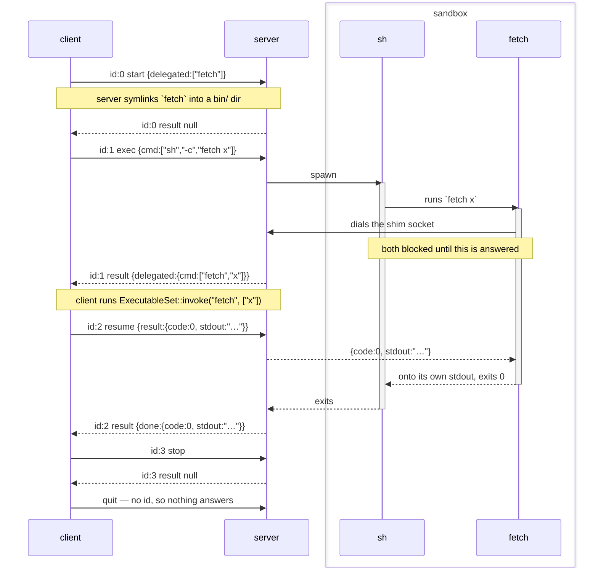
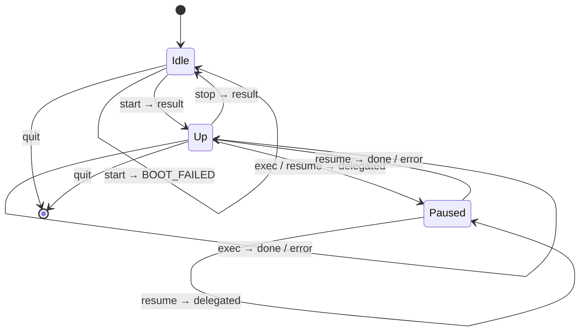

# Headless Console Protocol

How a client drives a console server, and how something inside that server calls back out to the client.
It's *headless* because there is first-intended to bot(e.g. AI agent) usage, rather than human.

Two things make it more than a remote `exec`:

1. JSON-RPC 2.0's object model — the three shapes, the `id` pairing, the error codes — encoded as BSON rather than as JSON text.
   The semantics are the spec's and read as it; the bytes are not, so a peer needs a BSON codec. See [Codec](#codec) for what that trade bought.
2. Execution runs both ways.
   A tool that only the client knows how to run ends up runnable inside a sandbox — the server asks for it by *answering*, and the client runs it.

**Each end of the channel does one job.** The client only asks; the server only answers.
Execution running both ways does *not* mean requests going both ways: a server that needs a delegated executable run says so in a `result`, on the request the client is already waiting on — see [Delegation](#delegation-and-execution-both-ways) for what that buys and what it costs.

Source: [`message/`](message/) for the objects, [`stdio/channel.rs`](stdio/channel.rs) for the wire, [`base.rs`](base.rs) for what each end can do, [`stdio/`](stdio/) for the ends themselves, [`console.rs`](console.rs) for the public end that walks the delegation chain.

---

## Transport

```
stdin    requests and responses in     ─┐
stdout   requests and responses out    ─┴─ the protocol's, and nothing else
stderr   logs, traces, panics             free-form, for a person
```

The same discipline an MCP stdio server keeps, and for the same reason: stdout *is* the framing channel, so one stray `println!` corrupts the stream rather than merely cluttering it.
It is a rule, not something the types enforce — holding `StdoutLock` for the process would make the mistake a hang instead, but that guard is not `Send`, and the handle is what an end keeps so that a writer can be moved to wherever it is written from.

A command's own stdio never appears here.
It is captured wherever the command runs and travels back inside a `result`, which is what makes one pair of descriptors enough where the old wire needed four (`fd 0` for the command *then* its stdin, `fd 1`/`fd 2` for its output, `fd 3` for delegation).

One pair is also all there is: delegation does not add a second channel, so this is the whole of the protocol's surface.

### Framing

```
[u32 len big-endian][BSON document]
```

A stream of messages has to be cut apart somewhere.
A length prefix says where before any of it is read, so there is no delimiter to search for and therefore none a payload could forge.
`len` is capped at **64 MiB** (`MAX_PAYLOAD`); a frame claiming more is refused rather than allocated, and a zero-length frame is refused because no message serializes to nothing.

Reading distinguishes three outcomes, which is the whole reason for the loop in `fill`:

| | means |
|---|---|
| no bytes before the header completes | the peer closed **between** frames — a clean end |
| bytes, then EOF | truncation — corruption, not an ending |
| header, then `len` bytes | a frame |

> **This header is redundant and kept anyway, for now.**
> It was here because a serialized message did not know its own length.
> A BSON document does — its first four bytes are an `int32`, little-endian, of the whole document including those four — so the header now duplicates what the payload already carries.
> Retiring it would also remove the one layer of this protocol that no peer can guess, which is worth more than the four bytes.
> Not done yet because it is a wire change and the codec swap already was one; `stdio/channel.rs` has what it takes.

---

## Codec

The wire is **BSON**, for two reasons.

**It has to be self-describing.**
`{"method":.., "params":..}` is adjacent tagging and `result` xor `error` is decided by which member is *present*, so a reader must look ahead — which rules out postcard and bincode.
A `result`'s type also depends on the method its `id` was issued for, so it is held as an untyped value until the pending request names it.

**It has to have a byte type.**
A command's output is most of what this channel carries and none of it is text.
JSON has no way to say so, which meant base64 at 1.37× — decoded again at the far end — or `[104,105,10]` at 4×.
BSON has `Binary`, so they travel as themselves.

What it cost is the off-the-shelf JSON-RPC library, which was the reason for JSON.
That is a real capability given up, and worth less than it looks: such a peer already needed bespoke framing (above), and both ends of this channel are in this workspace today.

What it did **not** cost is size where size matters, though the accounting is not one-sided.
BSON is not a compact format — array indices become keys (`["ls"]` is `{"0":"ls"}`) and every name is a C string — so a control frame is *larger* than its JSON spelling:

| frame | JSON | BSON | MessagePack |
|---|---|---|---|
| `exec {"cmd":["ls"]}` | 64 B | 84 B | 46 B |
| a 4 KiB `stdout` | ~5.5 KiB | ~4.1 KiB | ~4.1 KiB |

MessagePack and CBOR beat BSON on both lines and were the real alternatives.
BSON won on two things neither has: its documents are **self-delimiting**, which is what retires the framing header above, and it keeps a readable projection — `doc!` in the tests, Extended JSON for a person — so the wire can still be read member for member.

---

## JSON-RPC 2.0

The object model below is the spec's, member for member. Only the encoding is not — every example is written as Extended JSON would show it, so that the members are legible; `stdout` and `stderr` are `Binary` and not the strings they appear as.

Three object shapes, told apart the way the spec tells them apart — by which members are present, not by a tag we invented.

| present | is |
|---|---|
| `method` + `id` | a **request** |
| `method`, no `id` | a **notification** |
| `result` xor `error` (+ `id`) | a **response** |

Every request gets exactly one response, carrying the same `id`.

### Ids

`id` is a number, allocated by the **client** — the only end that issues requests — counting from zero, by one.
Nothing on the answering side reads a meaning into the number.

There is a single request outstanding at a time.
So what an `id` earns is not concurrency but **certainty about what an answer answers** — a response carrying an id nobody issued is a peer that has lost its place, and it can be dropped instead of being mistaken for the answer that was due.

It is also what threads a delegation together.
One execution is answered once per round trip — the `exec`, then each `resume` — and each response carries the id of the request it answers, so the client is never handed the answer to a different step than the one it is waiting on.

**Pair by `id`, not by position.**

### Where this departs from the spec

A JSON-RPC response does not name its method: the `id` identifies it and the caller is expected to remember what it asked.
Nothing here departs from that on the wire — but it means a response's `result` cannot be typed until it is matched with its request, which is why the Rust side holds it as an untyped value (`Outcome`) and `Outcome::take::<T>()` is where the caller applies what it knows.

### What is refused when reading

- `jsonrpc` missing, or not exactly `"2.0"`
- an unknown `method`
- `params` that are not what the method takes
- a request with no `id`; a `quit` **with** one
- `result` and `error` together, or neither
- `method` together with `result` or `error`

Unknown members are **ignored**, so a peer may add `trace_id` without breaking us.
Member order is free — `params` may arrive before the `method` that types it.

---

## Methods

| method | `params` | `result` |
|---|---|---|
| `start` | `{delegated, default_timeout_ms?}` | `null` |
| `exec` | `{cmd, timeout_ms?}` | `{done: {...}}` or `{delegated: {...}}` |
| `resume` | `{result: ...}` or `{error: {...}}` | `{done: {...}}` or `{delegated: {...}}` |
| `read` | `{path, offset?, len?}` | `{data, size}` |
| `write` | `{path, data?, offset?}` | `{size}` |
| `stop` | — | `null` |
| `quit` | — | *(notification)* |

**Every method is the client's.**
The channel runs one way: the client asks and never answers, the server answers and never asks.
There is no method a server issues, which is what [Delegation](#delegation-and-execution-both-ways) is about.

`params` is omitted entirely for a method that takes none: the spec allows leaving it out, and `null` is not one of the two types it permits.

### `start` — boot, and make these names runnable

```json
{"jsonrpc":"2.0","id":0,"method":"start","params":{"delegated":["fetch","ask"],"default_timeout_ms":30000}}
{"jsonrpc":"2.0","id":0,"result":null}
```

`delegated` is the names the client wants runnable *inside* the server's world.
Sorted, without duplicates, and each one should be **one plain path component** — a name becomes a filename in a `bin/` directory or the key a shim reports itself by, so `../../etc/foo` would put a symlink somewhere the backend does not reach and cannot clean up.

> **Not enforced today.**
> Nothing checks this, so a bad name is linked rather than answered with `INVALID_PARAMS`.
> The names reach a server from a client that is in-process with whoever chose them, which is the only thing standing in for the check — see [Session](#session).

Empty is not an error.
A client with nothing to delegate is still a client:

```json
{"jsonrpc":"2.0","id":0,"method":"start","params":{"delegated":[]}}
```

`default_timeout_ms` is the fallback for executions that set none — including the delegated calls the client did not write.
Omitted means no default, and then an execution without its own timeout runs until it finishes, or forever.

The response is the **readiness signal**.
Booting is not free — a micro-VM backend has a kernel to start — and a client should be able to pay for it before it knows what to run.
The old wire got this for nothing, because the server's blocking read of fd 0 *was* readiness; nothing blocks here, so it is said out loud.
A backend that cannot come up answers `BOOT_FAILED`, which the old wire had no way to report at all: a server that failed to set itself up could only die.

### `exec` — run this

```json
{"jsonrpc":"2.0","id":2,"method":"exec","params":{"cmd":["sh","-c","echo hi"],"timeout_ms":5000}}
{"jsonrpc":"2.0","id":2,"result":{"done":{"code":0,"stderr":{"$binary":{"base64":"","subType":"00"}},"stdout":{"$binary":{"base64":"aGkK","subType":"00"}},"truncated":false}}}
```

Minimal form — no timeout of its own:

```json
{"jsonrpc":"2.0","id":2,"method":"exec","params":{"cmd":["ls"]}}
```

| field | |
|---|---|
| `cmd` | already split into argv. Nothing consults a shell, so quoting and word rules stay wherever the command was composed; a caller that wants shell semantics asks outright — `["sh","-c","…"]`. Empty is `INVALID_PARAMS`. |
| `timeout_ms` | a **kill** on expiry: no grace period, no second signal, no negotiation. Falls back to `default_timeout_ms`. |
| `code` | the command's exit status; `128 + signal` when a signal killed it. |
| `stdout`/`stderr` | `Binary`, byte-exact, kept apart. |
| `truncated` | the command wrote more than the executor would hold, and this is the beginning of it. |

The `result` is not the execution's output but **how far it got**: `done` is the whole of it, `delegated` is the execution pausing on something only the client can run.
A client with nothing delegated never sees the second.
See [Delegation](#delegation-and-execution-both-ways).

### `resume` — the delegated call ended like this

```json
{"jsonrpc":"2.0","id":3,"method":"resume","params":{"result":{"code":0,"stdout":{"$binary":{"base64":"aGkK","subType":"00"}},"stderr":{"$binary":{"base64":"","subType":"00"}},"truncated":false}}}
{"jsonrpc":"2.0","id":3,"result":{"done":{"code":0,"stdout":{"$binary":{"base64":"aGkK","subType":"00"}},"stderr":{"$binary":{"base64":"","subType":"00"}},"truncated":false}}}
```

Only ever a reply to a `delegated`, and its `result` is the next step of the *same* execution — another `delegated`, or the end of it.

`params` is the two members a response spells an outcome with, because a delegated call can fail to produce one at all:

```json
{"jsonrpc":"2.0","id":3,"method":"resume","params":{"error":{"code":-32001,"message":"fetch: not a delegated executable"}}}
```

The server hands whichever arrives straight to the shim that is waiting, and does not read it.
A `resume` when nothing is paused is `INVALID_REQUEST`.

`stdout` and `stderr` stay apart because merging is something a requester can do and un-merging is not.
The interleaving between them is not preserved: two buffers are not one stream, and a caller that needs the order asks the command for it (`2>&1`).

`truncated` exists because silence would be worse than shortness.
A result travels in one frame under `MAX_PAYLOAD`, so an unbounded writer has to be cut off somewhere, and an agent reading output it does not know is partial will draw a conclusion from it.

**Bytes, not text.**
`stdout`, `stderr` and a file's `data` cross as BSON `Binary`, subtype `Generic` — at 1.0×, and byte-exact whether or not the output was ever UTF-8, which routinely it was not.
Getting this is the second half of [why the codec is BSON](#codec): JSON had no byte type, so the same payloads had to be base64 (1.37×) to avoid being `[104,105,10]` (4×).

The `bytes` helper no longer asks the codec whether it is human-readable, and that is deliberate rather than a simplification.
`params` and `result` pass through a `Bson` value before reaching the wire — they must, since a `result` is typed by a method only the caller knows — and `bson`'s value-level serializer reports itself human-readable.
Asking would therefore re-encode base64 at exactly the point the byte type was the point, and nothing on the wire would show it had happened.
`message/call.rs` holds the reasoning; a test asserts on the frame's bytes rather than on a round trip, because a round trip passes either way.

### `read` — hand back part of a file

```json
{"jsonrpc":"2.0","id":5,"method":"read","params":{"path":"out/log.txt","offset":4096,"len":1024}}
{"jsonrpc":"2.0","id":5,"result":{"data":{"$binary":{"base64":"aGkK","subType":"00"}},"size":10000}}
```

The path is resolved wherever the executor runs things, exactly as a relative path in `cmd` is, so it names the file a command would open by the same name.

| field | |
|---|---|
| `path` | UTF-8, resolved executor-side. |
| `offset` | where to start; omitted is the beginning. Past the end is not an error — the answer is empty `data` and the `size` that says so. |
| `len` | how many bytes at most; omitted is as many as there are. |
| `data` | `Binary`, byte-exact. |
| `size` | the **file's** size, not `data`'s length. |

`size` is what makes a bounded read usable.
One frame holds the answer, so a file larger than `MAX_PAYLOAD` comes back in pieces and the executor hands back less than `len` asked for when the rest would not fit.
Comparing what arrived against `size` is the only thing that says there is more, and asking again from further along is how to get it — a reader that ignores it cannot tell a whole small file from the front of a large one.

### `write` — put these bytes in a file

```json
{"jsonrpc":"2.0","id":6,"method":"write","params":{"path":"in/data","data":{"$binary":{"base64":"aGkK","subType":"00"}}}}
{"jsonrpc":"2.0","id":6,"result":{"size":3}}
```

| field | |
|---|---|
| `path` | as `read`'s. Any directory above it has to exist; the file itself does not. |
| `data` | `Binary`. Omitted is empty, which for a whole-file write means an empty file. |
| `offset` | omitted **replaces** the file — created if it was not there, cut to length if it was. Present **overwrites** from there and leaves whatever lies past the bytes written, extending the file with zeroes if it is beyond the end. |
| `size` | the file's size afterwards. |

Omitted and `0` are therefore different, and a requester that means to replace a file sends neither: the whole-file case says nothing about what was there before, and the positioned case says nothing about the rest of the file.

A `write` that fails with `IO_FAILED` says nothing about how much of `data` landed.
The file is whatever it is, and a requester that needs to know asks with a `read`.

### `stop` — release what `start` booted

```json
{"jsonrpc":"2.0","id":4,"method":"stop"}
{"jsonrpc":"2.0","id":4,"result":null}
```

Much what stopping a VM is: the guest goes away, the socket and the symlinks go with it, and a scratch directory is cleaned up by whoever made it rather than left for someone to find later.
Backends differ in what that costs, which is why the client asks rather than assuming.

Afterwards the session is back where it was before `start`, so **another `start` is allowed** — a server process can outlive the resources it booted, which is worth something when booting is the expensive part.
`Console::stop` is therefore not the end of anything; dropping the `Console` is what sends `quit`.
What `quit` costs to carry out is the transport's — over stdio it also closes the server's stdin and waits for the process, because that client is what started it.

`stop` does **not** wait for an `exec` that is still running.
A client that wants its commands finished first waits for their responses — which it can, since it is the only thing asking on that channel.

### `quit` — the session is over

```json
{"jsonrpc":"2.0","method":"quit"}
```

The one notification, so no `id` and no response: there is nothing a process can say after this that a closed channel does not say better.
Sending it at all is what lets the other end tell a finished session from a peer that died.

An `exec` still running is still answered — a request the server accepted is one it owes a response for, and `quit` arriving first is the client's ordering rather than permission to drop it.

---

## Delegation, and execution both ways

This is the part that is not a remote `exec`.

A delegated executable's behaviour lives in the **client's** `ExecutableSet` — a Rust closure, an HTTP call, whatever the host wants a tool to mean.
The server cannot have it.
But a command running inside the server's world must be able to invoke it by name, as if it were a program on `PATH`.

So the server has to ask the client for it.
**It asks by answering.**

### `delegated` is a response, not a request

A `delegated` is a complete, ordinary JSON-RPC response to the `exec` the client is already waiting on.
It means *this execution is not over, and here is what I need from you*.
The client runs the name, says so with `resume`, and gets the next step back.
The chain ends at `done`.

So the server never issues a request and the client never answers one.
There is one channel, one end that asks, one end that answers — no pending table anywhere, no reader that must not block, and no channel per delegated call.

### Why not a request from the server

That was the earlier design, twice over.

Sending the server's `exec` **on the console channel** makes every end both a requester and an answerer: a pending table to match late responses, and a reader that must never block on work it is also the only one who can read for.
The cost was not the table — it was that a server answering an `exec` inline would sit waiting for a delegated answer that only its own read loop could deliver.

Giving the shim **a channel of its own to the client** fixed that, and cost something else: the client had to be an answering end too.
A listener to bind, a thread per delegated call, an accept loop that could never be joined because a listener with nobody dialling it blocks forever, and a socket address only the client could choose but only the server's environment could carry.
It also put the hop in the wrong place — a shim inside a micro-VM guest would have to reach across the guest boundary to the host, which a unix socket cannot do.

Answering with `delegated` needs neither.
The shim's hop is to the **server**, which is on the same side of every boundary as the command that ran it, and the console channel — which already crosses whatever there is to cross — carries the call the rest of the way.

### The one channel

```
console channel      client ──asks──► server          one, for the session
shim socket          shim   ──asks──► server          server-local, not this protocol
```

The **server** binds whatever a shim dials and names it in the environment of everything an execution spawns; nothing about it appears in this protocol.

A solid arrow is a request and a dashed one a response.
**On the console channel — the two leftmost lifelines — every solid arrow starts at the client**, and every one of the server's is dashed.
That is the whole diagram's point.



Note that `id:1` is answered **once**, with `delegated`, and the execution's own ending goes to `id:2` — the `resume` that was outstanding by then.
Every request still gets exactly one response.

The shim's dial is the only arrow that is not this protocol: it is server-local, and the server is what turns it into the `delegated` above it.

And note what the delegated call carries: an ordinary `exec`'s `params`, verbatim.
An execution request is an execution request no matter who is asking whom — a command, output, a code at the end — so there is one shape and one codec in the system rather than two.

### Consequences

**Delegated calls are served one at a time.**
A response can carry one `delegated`, so a command that starts several delegated executables together (`foo & bar`, `make -j8`) has them run in turn.
The outer execution's `timeout_ms` has to cover the sum.

That is latency and not a deadlock, and **only because delegated calls are independent of each other**: nothing an `exec` carries is input, so no delegated call is waiting on another being served first.
`foo | bar` where both are delegated works because `bar` never reads what `foo` wrote.

> **This is the line of reasoning to change first.**
> If input ever reaches a delegated call, serving them in turn stops being safe, and delegation needs a shape that can carry more than one at a time.

**The client is purely an asking end.**
No listener, no accept loop, no task per delegated call, and nothing to join at shutdown.
`Console::exec` walks the chain on the caller's own task and returns one result for the one command it was given.

**The server interleaves.**
It cannot run a command to completion and then answer, because the delegated call arrives while the command is still running.
So an execution is a `select!` over *a shim connected* and *the command ended*, which is where the concurrency that used to be the client's now lives.

**Both ends are async, and neither is concurrent with itself.**
Every method that waits is a future, so a caller can drive many consoles from one runtime — but one console's methods take `&mut self`, because the protocol has one call outstanding at a time and a delegated execution owes an answer before anything else may be asked.
Concurrency is *across* sessions, never within one.

**Shutting down is one-sided.**
Ending the session ends the console channel.
`Console::close` is the ending that reports how it went; dropping a console spawns the same pair of calls and cannot wait for them, which is the whole difference between the two.
The server's shim socket is bound for the life of the process, not of a session, so that the path in every execution's environment stays the one a shim can dial.

---

## Errors

An `error` is the only failure channel, and the numeric `code` is what makes it usable: a requester branches on the code and shows the `message`.
`data` is optional and nothing here requires it.

```json
{"jsonrpc":"2.0","id":2,"error":{"code":-32000,"message":"killed after 5000ms"}}
```

| code | method | means |
|---|---|---|
| `-32000` | `exec` | **timed out** — killed at `timeout_ms`. There is no result: a killed command has no exit code, and whatever it wrote is gone with it. |
| `-32001` | `exec` | **not executable** — the program was not there, or would not start. |
| `-32002` | `start` | **boot failed** — the backend could not be brought up. |
| `-32003` | `stop` | **stop failed** — the resources may still be held. |
| `-32004` | `exec`, `stop` | **not started** — no `start` has been answered, or a `stop` has undone it. |
| `-32005` | `read`, `write` | **not found** — nothing at the path. For a `write` that means a directory above it, since the file itself is created if it is missing. |
| `-32006` | `read`, `write` | **is a directory** — the name is taken, and by something a retry will not turn into a file. |
| `-32007` | `read`, `write` | **io failed** — the path named a file and the executor still could not go on: permissions, a full disk, a backend that went away mid-operation. |
| `-32600` | any | invalid request — including a `resume` when nothing is paused on a delegated call. |
| `-32601` | any | method not found |
| `-32602` | any | invalid params — an empty `cmd`. A delegated name that is not a plain path component *should* be this and is not checked; see [`start`](#start--boot-and-make-these-names-runnable). |
| `-32603` | any | internal error |

`-32000`…`-32099` is the range the spec reserves for implementation-defined server errors.
`-32700` (parse error) belongs to whoever reads the frame, not to a method.

### Why a timeout is an error and not a result

Because there is nothing to put in a result.
It is also something a requester acts on specifically — retry with more time, or give up — which is exactly what a code is for.

### Why an error is not an exit code

The old wire could only borrow the shell's conventions: 127 for a program that was not there, 126 for one that could not be started.
Neither ever proved the failure was the server's, because every code in `0..=255` is reachable by an ordinary `exit()`.
An `error` cannot be mistaken for a command's own status, because it does not carry one.

---

## Session



From `Idle`, an `exec` or a `stop` is `NOT_STARTED`.
From `Up`, a second `start` is `INVALID_REQUEST`, and so is a `resume` — nothing is paused.
A failed `start` leaves `Idle`, so nothing thinks it is up.

`Paused` is an execution that has been answered with `delegated` and not yet resumed.
It is the client's turn and **only** a `resume` belongs there: the execution owes an answer that has not been sent, so a client asking about anything else is asking about a request it has not been answered on.
There is at most one `Paused` execution, which is why a `resume` needs nothing to say *which* delegated call it answers.

> **Barely enforced today, and only ever the answering side's to enforce.**
> An answering end moves frames and reads no meaning into them, and the shared server layer that held these rules is gone.
> A backend refuses a `resume` that nothing is waiting on, because it is the only end that knows — but `NOT_STARTED` and a second `start` are not checked, and a delegated name is linked unchecked.
> The asking side keeps no second copy of any of it: `Console` sends what it is asked to send, so an `exec` before `start` reaches the channel and gets whatever that server answers.
> Which is why the gaps above are visible rather than hidden behind one well-behaved client.
>
> Where they belong when they come back: not in each backend, because every backend's version would be the same and would be the same to get wrong.
> A backend should implement only the things that differ — making a name runnable, running a command while letting a delegated call through, releasing what booting took — and never see a broken session.
>
> The interleaving loop is a candidate for the same treatment.
> Every backend's version of "wait for a shim or the command's end, answer the console channel, hand the outcome back" is the same, and it is now the most intricate thing a backend does.

---

## What this protocol deliberately cannot do

Each of these is a capability given up on purpose, and each has one line of reasoning that would have to change first.

| not possible | why not |
|---|---|
| watch a command work | an agent cannot use a partial answer, so early output arrives to nobody. Streaming would cost a second shape for every ending and a second code path in every consumer — and JSON-RPC has no spelling for it: a request has one response. |
| drive an interactive command | its prompt would arrive after the answer was due. An `exec` carries no input at all; what a command is to read goes where it will find it with a `write` beforehand. |
| run something that never ends | `tail -f` has no result to send. `timeout_ms` is what ends it; without one, such an execution simply never answers. |
| cancel one execution | `stop` releases the whole session, not a command. Let the timeout expire. |
| output larger than 64 MiB | one frame, one result. `truncated` says when it happened — and an agent cannot read 64 MiB either, so the bound is closer to a feature. A *file* larger than that is readable, because `read` is bounded on purpose and `size` says where to ask next. |
| run two delegated calls at once | a response carries one `delegated`. Needs delegated calls to stop being independent before it is worth a shape that carries several — see [Consequences](#consequences). |
