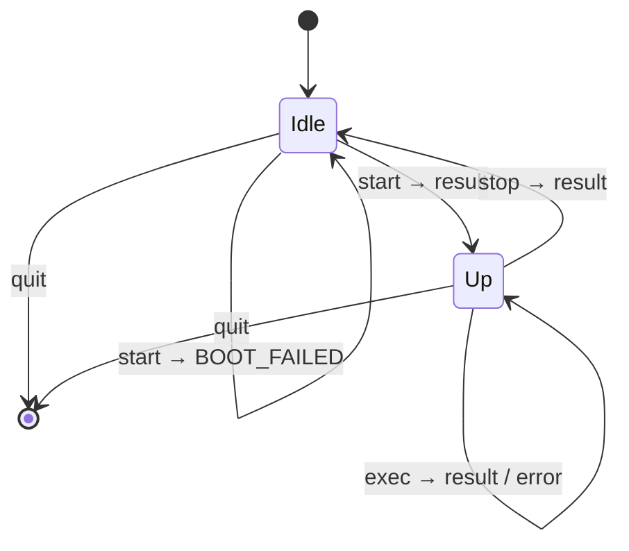

# Headless Console Protocol

How a client drives a console server, and how something inside that server calls back out to the client.

*Headless* because there is first-intended to bot(e.g. AI agent) usage, rather than human.

Two things make it more than a remote `exec`:

1. Fully compatible to JSON-RPC 2.0
2. Execution runs both ways.
   A tool that only the client knows how to run ends up runnable inside a sandbox — the client answers an `exec` for it, on a channel of its own.

**Each end of a channel does one job.** A requesting end only asks; an answering end only answers.
Execution running both ways therefore means *two channels*, not one channel used both ways — see [Delegation](#delegation-and-execution-both-ways) for what that buys and what it costs.

Source: [`message/`](message/) for the objects, [`stdio/channel.rs`](stdio/channel.rs) for the wire, [`base.rs`](base.rs) for what each end can do, [`stdio/`](stdio/) for the ends themselves, [`console.rs`](console.rs) for the public end that holds both channels.

---

## Transport

```
stdin    requests and responses in     ─┐
stdout   requests and responses out    ─┴─ the protocol's, and nothing else
stderr   logs, traces, panics             free-form, for a person
```

The same discipline an MCP stdio server keeps, and for the same reason: stdout *is* the framing channel, so one stray `println!` corrupts the stream rather than merely cluttering it.
It is a rule, not something the types enforce — holding `StdoutLock` for the process would make the mistake a hang instead, but that guard is not `Send`, and the handle is what an end keeps so that a writer can be moved to wherever it is written from.

A command's own stdio never appears here.
It is captured wherever the command runs and travels back inside a `result`, which is what makes one pair of descriptors enough where the old wire needed four (`fd 0` for the command *then* its stdin, `fd 1`/`fd 2` for its output, `fd 3` for delegation).

### Framing

```
[u32 len big-endian][JSON object]
```

A serialized message does not know its own length, and a stream of them has to be cut apart somewhere.
A length prefix says where before any of it is read, so there is no delimiter to search for and therefore none a payload could forge.
`len` is capped at **64 MiB** (`MAX_PAYLOAD`); a frame claiming more is refused rather than allocated, and a zero-length frame is refused because no message serializes to nothing.

Reading distinguishes three outcomes, which is the whole reason for the loop in `fill`:

| | means |
|---|---|
| no bytes before the header completes | the peer closed **between** frames — a clean end |
| bytes, then EOF | truncation — corruption, not an ending |
| header, then `len` bytes | a frame |

> **Note.**
> This is not a standard JSON-RPC framing.
> LSP uses `Content-Length: N\r\n\r\n`; MCP stdio uses one JSON object per line.
> A peer with an off-the-shelf JSON-RPC library still needs its own framing for us.
> The choice is localized to `stdio/channel.rs` if that trade stops being worth it.

---

## JSON-RPC 2.0

Three object shapes, told apart the way the spec tells them apart — by which members are present, not by a tag we invented.

| present | is |
|---|---|
| `method` + `id` | a **request** |
| `method`, no `id` | a **notification** |
| `result` xor `error` (+ `id`) | a **response** |

Every request gets exactly one response, carrying the same `id`.

### Ids

`id` is a number, allocated by whoever issues the request and **unique only among that issuer's own**.
Each end counts for itself, from zero, by one.

The two ends can hand out the same number without either being wrong: a response travels back the way its request came, so what pairs them is the direction *and* the id.
Neither end can be handed an answer to a request it did not make, so there is nothing for a split id space to prevent.

On any one channel today there is a single request outstanding at a time: a console channel is driven by one caller waiting for each answer, and a delegate channel carries one call and ends.
So what an `id` earns is not concurrency but **certainty about what an answer answers** — a response carrying an id nobody issued is a peer that has lost its place, and it can be dropped instead of being mistaken for the answer that was due.

Several delegated calls *can* be in flight together (`foo | bar`, `make -j8`) — one channel each, not one channel shared.
That is what the id space would be earning if a channel ever carried more than one, and it costs nothing to keep.

**Pair by `id`, not by position.**

### Where this departs from the spec

A JSON-RPC response does not name its method: the `id` identifies it and the caller is expected to remember what it asked.
Nothing here departs from that on the wire — but it means a response's `result` cannot be typed until it is matched with its request, which is why the Rust side holds it as an untyped value (`Outcome`) and `Outcome::take::<T>()` is where the caller applies what it knows.

### What is refused when reading

- `jsonrpc` missing, or not exactly `"2.0"`
- an unknown `method`
- `params` that are not what the method takes
- a request with no `id`; a `quit` **with** one
- `result` and `error` together, or neither
- `method` together with `result` or `error`

Unknown members are **ignored**, so a peer may add `trace_id` without breaking us.
Member order is free — `params` may arrive before the `method` that types it.

---

## Methods

| method | channel | `params` | `result` |
|---|---|---|---|
| `start` | console: client → server | `{delegated, default_timeout_ms?}` | `null` |
| `exec` | console: client → server | `{cmd, stdin?, timeout_ms?}` | `{code, stdout, stderr, truncated}` |
| `exec` | delegate: shim → client | `{cmd, stdin?, timeout_ms?}` | `{code, stdout, stderr, truncated}` |
| `stop` | console: client → server | — | `null` |
| `quit` | console: client → server | — | *(notification)* |

Every channel runs one way: the end that asks on it never answers on it, and the end that answers never asks.
`exec` appears twice because it is the same request on both, not because either channel carries it both ways.

`params` is omitted entirely for a method that takes none: the spec allows leaving it out, and `null` is not one of the two types it permits.

### `start` — boot, and make these names runnable

```json
{"jsonrpc":"2.0","id":0,"method":"start","params":{"delegated":["fetch","ask"],"default_timeout_ms":30000}}
{"jsonrpc":"2.0","id":0,"result":null}
```

`delegated` is the names the client wants runnable *inside* the server's world.
Sorted, without duplicates, and each one should be **one plain path component** — a name becomes a filename in a `bin/` directory or the key a shim reports itself by, so `../../etc/foo` would put a symlink somewhere the backend does not reach and cannot clean up.

> **Not enforced today.**
> Nothing checks this, so a bad name is linked rather than answered with `INVALID_PARAMS`.
> The names reach a server from a client that is in-process with whoever chose them, which is the only thing standing in for the check — see [Session](#session).

Empty is not an error.
A client with nothing to delegate is still a client:

```json
{"jsonrpc":"2.0","id":0,"method":"start","params":{"delegated":[]}}
```

`default_timeout_ms` is the fallback for executions that set none — including the delegated calls the client did not write.
Omitted means no default, and then an execution without its own timeout runs until it finishes, or forever.

The response is the **readiness signal**.
Booting is not free — a micro-VM backend has a kernel to start — and a client should be able to pay for it before it knows what to run.
The old wire got this for nothing, because the server's blocking read of fd 0 *was* readiness; nothing blocks here, so it is said out loud.
A backend that cannot come up answers `BOOT_FAILED`, which the old wire had no way to report at all: a server that failed to set itself up could only die.

### `exec` — run this

```json
{"jsonrpc":"2.0","id":2,"method":"exec","params":{"cmd":["sh","-c","cat && fetch x"],"stdin":"aGkK","timeout_ms":5000}}
{"jsonrpc":"2.0","id":2,"result":{"code":0,"stderr":"","stdout":"aGkK","truncated":false}}
```

Minimal form — no input, no timeout of its own:

```json
{"jsonrpc":"2.0","id":2,"method":"exec","params":{"cmd":["ls"]}}
```

| field | |
|---|---|
| `cmd` | already split into argv. Nothing consults a shell, so quoting and word rules stay wherever the command was composed; a caller that wants shell semantics asks outright — `["sh","-c","…"]`. Empty is `INVALID_PARAMS`. |
| `stdin` | **all** of the input, base64, sent up front. Omitted or empty means immediate EOF. |
| `timeout_ms` | a **kill** on expiry: no grace period, no second signal, no negotiation. Falls back to `default_timeout_ms`. |
| `code` | the command's exit status; `128 + signal` when a signal killed it. |
| `stdout`/`stderr` | base64, byte-exact, kept apart. |
| `truncated` | the command wrote more than the executor would hold, and this is the beginning of it. |

There is no working directory.
Sending one would be a host path, which means nothing inside a micro-VM guest, so *where* to run something only becomes expressible once both ends agree on what a path is — which is a workspace volume mount's job.

`stdout` and `stderr` stay apart because merging is something a requester can do and un-merging is not.
The interleaving between them is not preserved: two buffers are not one stream, and a caller that needs the order asks the command for it (`2>&1`).

`truncated` exists because silence would be worse than shortness.
A result travels in one frame under `MAX_PAYLOAD`, so an unbounded writer has to be cut off somewhere, and an agent reading output it does not know is partial will draw a conclusion from it.

**Base64, not an array of numbers.**
JSON has no byte type, so `[104,105,10]` — four characters per byte — would be the default spelling for the bulk of what this channel carries.
Base64 is 1.37× instead of 4×, and it survives output that is not UTF-8, which output routinely is not.
The codec is *asked* rather than assumed, so CBOR or MessagePack would carry the same objects with native bytes and no base64 at all.

### `stop` — release what `start` booted

```json
{"jsonrpc":"2.0","id":4,"method":"stop"}
{"jsonrpc":"2.0","id":4,"result":null}
```

Much what stopping a VM is: the guest goes away, the socket and the symlinks go with it, and a scratch directory is cleaned up by whoever made it rather than left for someone to find later.
Backends differ in what that costs, which is why the client asks rather than assuming.

Afterwards the session is back where it was before `start`, so **another `start` is allowed** — a server process can outlive the resources it booted, which is worth something when booting is the expensive part.
`Console::stop` is therefore not the end of anything; `Console::shutdown` is the one that sends `quit` and collects the process.

`stop` does **not** wait for an `exec` that is still running.
A client that wants its commands finished first waits for their responses — which it can, since it is the only thing asking on that channel.

### `quit` — the session is over

```json
{"jsonrpc":"2.0","method":"quit"}
```

The one notification, so no `id` and no response: there is nothing a process can say after this that a closed channel does not say better.
Sending it at all is what lets the other end tell a finished session from a peer that died.

An `exec` still running is still answered — a request the server accepted is one it owes a response for, and `quit` arriving first is the client's ordering rather than permission to drop it.

---

## Delegation, and execution both ways

This is the part that is not a remote `exec`.

A delegated executable's behaviour lives in the **client's** `ExecutableSet` — a Rust closure, an HTTP call, whatever the host wants a tool to mean.
The server cannot have it.
But a command running inside the server's world must be able to invoke it by name, as if it were a program on `PATH`.

So the client answers an `exec` for it — same method, same shapes, **a different channel**.

### Why not the same channel

Because then the console channel would carry requests in both directions, and every end of it would have to be both a requester and an answerer: a pending table to match late responses, and a reader that must never block on work it is also the only one who can read for.
That was the earlier design, and the cost was not the table — it was that a server answering an `exec` inline would sit waiting for a delegated answer that only its own read loop could deliver.

One channel per direction of asking removes the problem rather than managing it.
A requesting end has no pending table because everything arriving on it is the answer to what it just asked; an answering end has no read-while-blocked problem because nothing it needs ever arrives on the channel it is answering.

### The two channels

```
console channel      client ──asks──► server        one, for the session
delegate channel     shim   ──asks──► client        one per delegated call
```

The **client** binds whatever a shim dials and hands the address to the server's environment; nothing about it appears in this protocol.
The server never sees a delegated call at all: it puts the name on `PATH` and is done.

```
  client                                                server            sandbox
    │                                                      │                  │
    │ ── {id:0, method:"start",                             │                  │
    │      params:{delegated:["fetch"]}} ─────────────────► │                  │
    │                                                      ├─ symlink `fetch`  │
    │                                                      │  onto PATH        │
    │ ◄─────────────────────────── {id:0, result:null} ──── │                  │
    │                                                      │                  │
    │ ── {id:1, method:"exec",                              │                  │
    │      params:{cmd:["sh","-c","fetch x"]}} ───────────► │                  │
    │                                                      ├──── run ────────► │
    │                                                      │            sh runs
    │                                                      │            `fetch x`
    │                                                      │                  │
    │        ┌─── delegate channel ─────────────────────────┼──── shim dials ──┤
    │        │                                             │       (blocked)   │
    │ ◄── {id:0, method:"exec", params:{cmd:["fetch","x"]}} ┼───────────────────┤
    ├─ ExecutableSet::invoke("fetch", ["x"])                │                  │
    │ ── {id:0, result:{code:0, stdout:"…"}} ───────────────┼──────────────────►│
    │        └─── channel ends ────────────────────────────┼───────────────────┤
    │                                                      │            sh finishes
    │ ◄── {id:1, result:{code:0, stdout:"…"}} ───────────── │                  │
    │                                                      │                  │
    │ ── {id:2, method:"stop"} ──────────────────────────►  │                  │
    │ ◄── {id:2, result:null} ───────────────────────────── │                  │
    │ ── {method:"quit"} ────────────────────────────────►  │                  │
```

Note what the two `exec` requests have in common: **nothing distinguishes them but which channel they arrived on.**
An execution request is an execution request no matter who asks — a command, some input, output, a code at the end — so there is one method and one result shape, and one codec in the system rather than two.

Both delegated `id`s are `0` because a delegate channel carries one call: there is nothing for an id to tell apart, and it is on the wire only because a request without one would be a notification.

### Consequences

**Concurrent, not nested.**
Several delegated calls can be outstanding together, each on its own channel, and the client gives each channel a thread.
Serving them in turn would deadlock a pipeline: `foo | bar` starts both before either finishes, and the second would wait for the first's answer, which waits for the second to be read.

**No thread is waiting on a channel it also has to read.**
The console channel's answerer is a plain sequential loop — read a request, answer it, read the next — because nothing it needs to answer can arrive on it.
That is the whole benefit of the split, and it is why the earlier design's "the reader must never block on backend work" rule no longer exists to break.

**Shutting down is one-sided.**
Ending the session ends the console channel.
Whatever accepts delegate channels is not ended by that and is not waited for: a listener with nobody dialling it blocks forever, so joining it would hang.

---

## Errors

An `error` is the only failure channel, and the numeric `code` is what makes it usable: a requester branches on the code and shows the `message`.
`data` is optional and nothing here requires it.

```json
{"jsonrpc":"2.0","id":2,"error":{"code":-32000,"message":"killed after 5000ms"}}
```

| code | method | means |
|---|---|---|
| `-32000` | `exec` | **timed out** — killed at `timeout_ms`. There is no result: a killed command has no exit code, and whatever it wrote is gone with it. |
| `-32001` | `exec` | **not executable** — the program was not there, or would not start. |
| `-32002` | `start` | **boot failed** — the backend could not be brought up. |
| `-32003` | `stop` | **stop failed** — the resources may still be held. |
| `-32004` | `exec`, `stop` | **not started** — no `start` has been answered, or a `stop` has undone it. |
| `-32600` | any | invalid request |
| `-32601` | any | method not found |
| `-32602` | any | invalid params — an empty `cmd`. A delegated name that is not a plain path component *should* be this and is not checked; see [`start`](#start--boot-and-make-these-names-runnable). |
| `-32603` | any | internal error |

`-32000`…`-32099` is the range the spec reserves for implementation-defined server errors.
`-32700` (parse error) belongs to whoever reads the frame, not to a method.

### Why a timeout is an error and not a result

Because there is nothing to put in a result.
It is also something a requester acts on specifically — retry with more time, or give up — which is exactly what a code is for.

### Why an error is not an exit code

The old wire could only borrow the shell's conventions: 127 for a program that was not there, 126 for one that could not be started.
Neither ever proved the failure was the server's, because every code in `0..=255` is reachable by an ordinary `exit()`.
An `error` cannot be mistaken for a command's own status, because it does not carry one.

---

## Session



From `Idle`, an `exec` or a `stop` is `NOT_STARTED`.
From `Up`, a second `start` is `INVALID_REQUEST`.
A failed `start` leaves `Idle`, so nothing thinks it is up.

> **Not enforced on the answering side today.**
> The shared server layer that held these rules is gone, and nothing has replaced it: an answering end moves frames and reads no meaning into them.
> `Console` keeps the flag on the *asking* side, so an `exec` before `start` never reaches a channel — but that is one client being well-behaved, not the protocol being upheld.
> A peer that asks out of order gets whatever the backend does, and a delegated name is linked unchecked.
>
> Where they belong when they come back: not in each backend, because every backend's version would be the same and would be the same to get wrong.
> A backend should implement only the three things that differ — making a name runnable, running a command, releasing what booting took — and never see a broken session.

---

## What this protocol deliberately cannot do

Each of these is a capability given up on purpose, and each has one line of reasoning that would have to change first.

| not possible | why not |
|---|---|
| watch a command work | an agent cannot use a partial answer, so early output arrives to nobody. Streaming would cost a second shape for every ending and a second code path in every consumer — and JSON-RPC has no spelling for it: a request has one response. |
| drive an interactive command | its prompt would arrive after the answer was due. Input therefore goes with the request, which is the same trade in the other direction. |
| run something that never ends | `tail -f` has no result to send. `timeout_ms` is what ends it; without one, such an execution simply never answers. |
| say where to run something | a host path means nothing inside a guest. Needs a workspace volume mount first. |
| cancel one execution | `stop` releases the whole session, not a command. Let the timeout expire. |
| output larger than 64 MiB | one frame, one result. `truncated` says when it happened — and an agent cannot read 64 MiB either, so the bound is closer to a feature. |
