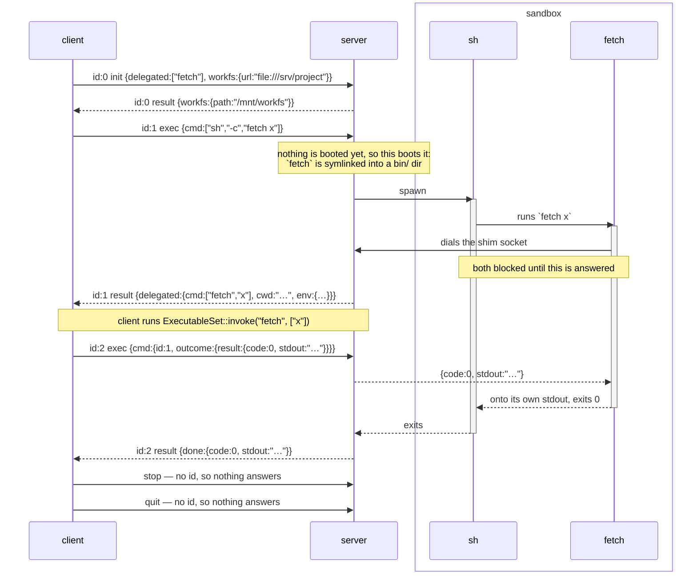
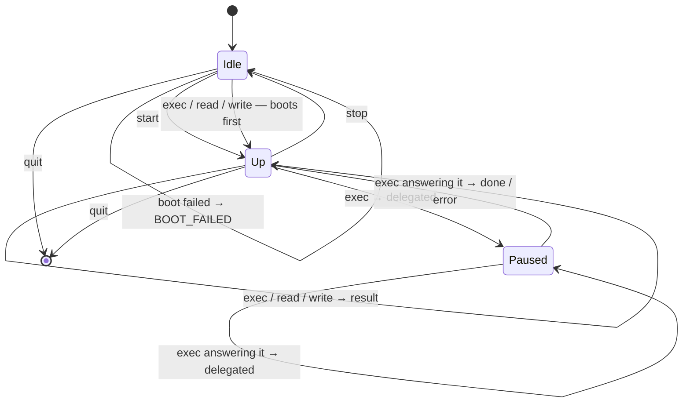

# Headless Console Protocol

How a client drives a console server, and how something inside that server calls back out to the client.
It's *headless* because there is first-intended to bot(e.g. AI agent) usage, rather than human.

Two things make it more than a remote `exec`:

1. JSON-RPC 2.0's object model — the three shapes, the `id` pairing, the error codes — encoded as BSON rather than as JSON text.
   The semantics are the spec's and read as it; the bytes are not, so a peer needs a BSON codec. See [Codec](#codec) for what that trade bought.
2. Execution runs both ways.
   A tool that only the client knows how to run ends up runnable inside a sandbox — the server asks for it by *answering*, and the client runs it.
3. The session declares a **workfs**, and the server says where it put it.
   The client names a tree by URL, the server answers with a path in its own filesystem, and every path in the protocol after that is spelled under that one — so a file name means the same thing to a command, to a `read`, and to a delegated executable. See [`workfs`](#workfs--what-can-be-reached).

**Each end of the channel does one job.** The client only asks; the server only answers.
Execution running both ways does *not* mean requests going both ways: a server that needs a delegated executable run says so in a `result`, on the request the client is already waiting on — see [Delegation](#delegation-and-execution-both-ways) for what that buys and what it costs.

Source: [`message/`](message/) for the objects, [`stdio/channel.rs`](stdio/channel.rs) for the wire, [`base.rs`](base.rs) for what each end can do, [`stdio/`](stdio/) for the ends themselves, [`console.rs`](console.rs) for the public end that walks the delegation chain.

---

## Transport

```
stdin    requests and responses in     ─┐
stdout   requests and responses out    ─┴─ the protocol's, and nothing else
stderr   logs, traces, panics             free-form, for a person
```

The same discipline an MCP stdio server keeps, and for the same reason: stdout *is* the framing channel, so one stray `println!` corrupts the stream rather than merely cluttering it.
It is a rule, not something the types enforce — holding `StdoutLock` for the process would make the mistake a hang instead, but that guard is not `Send`, and the handle is what an end keeps so that a writer can be moved to wherever it is written from.

A command's own stdio never appears here.
It is captured wherever the command runs and travels back inside a `result`, which is what makes one pair of descriptors enough where the old wire needed four (`fd 0` for the command *then* its stdin, `fd 1`/`fd 2` for its output, `fd 3` for delegation).

One pair is also all there is: delegation does not add a second channel, so this is the whole of the protocol's surface.

### Framing

```
[u32 len big-endian][BSON document]
```

A stream of messages has to be cut apart somewhere.
A length prefix says where before any of it is read, so there is no delimiter to search for and therefore none a payload could forge.
`len` is capped at **64 MiB** (`MAX_PAYLOAD`); a frame claiming more is refused rather than allocated, and a zero-length frame is refused because no message serializes to nothing.

Reading distinguishes three outcomes, which is the whole reason for the loop in `fill`:

| | means |
|---|---|
| no bytes before the header completes | the peer closed **between** frames — a clean end |
| bytes, then EOF | truncation — corruption, not an ending |
| header, then `len` bytes | a frame |

> **This header is redundant and kept anyway, for now.**
> It was here because a serialized message did not know its own length.
> A BSON document does — its first four bytes are an `int32`, little-endian, of the whole document including those four — so the header now duplicates what the payload already carries.
> Retiring it would also remove the one layer of this protocol that no peer can guess, which is worth more than the four bytes.
> Not done yet because it is a wire change and the codec swap already was one; `stdio/channel.rs` has what it takes.

---

## Codec

The wire is **BSON**, for two reasons.

**It has to be self-describing.**
`{"method":.., "params":..}` is adjacent tagging and `result` xor `error` is decided by which member is *present*, so a reader must look ahead — which rules out postcard and bincode.
A `result`'s type also depends on the method its `id` was issued for, so it is held as an untyped value until the pending request names it.

**It has to have a byte type.**
A command's output is most of what this channel carries and none of it is text.
JSON has no way to say so, which meant base64 at 1.37× — decoded again at the far end — or `[104,105,10]` at 4×.
BSON has `Binary`, so they travel as themselves.

What it cost is the off-the-shelf JSON-RPC library, which was the reason for JSON.
That is a real capability given up, and worth less than it looks: such a peer already needed bespoke framing (above), and both ends of this channel are in this workspace today.

What it did **not** cost is size where size matters, though the accounting is not one-sided.
BSON is not a compact format — array indices become keys (`["ls"]` is `{"0":"ls"}`) and every name is a C string — so a control frame is *larger* than its JSON spelling:

| frame | JSON | BSON | MessagePack |
|---|---|---|---|
| `exec {"cmd":["ls"]}` | 64 B | 84 B | 46 B |
| a 4 KiB `stdout` | ~5.5 KiB | ~4.1 KiB | ~4.1 KiB |

MessagePack and CBOR beat BSON on both lines and were the real alternatives.
BSON won on two things neither has: its documents are **self-delimiting**, which is what retires the framing header above, and it keeps a readable projection — `doc!` in the tests, Extended JSON for a person — so the wire can still be read member for member.

---

## JSON-RPC 2.0

The object model below is the spec's, member for member. Only the encoding is not — every example is written as Extended JSON would show it, so that the members are legible; `stdout` and `stderr` are `Binary` and not the strings they appear as.

Three object shapes, told apart the way the spec tells them apart — by which members are present, not by a tag we invented.

| present | is |
|---|---|
| `method` + `id` | a **request** |
| `method`, no `id` | a **notification** |
| `result` xor `error` (+ `id`) | a **response** |

Every request gets exactly one response, carrying the same `id`.

### Ids

`id` is a number, allocated by the **client** — the only end that issues requests — counting from zero, by one.
Nothing on the answering side reads a meaning into the number.

There is a single request outstanding at a time.
So what an `id` earns is not concurrency but **certainty about what an answer answers** — a response carrying an id nobody issued is a peer that has lost its place, and it can be dropped instead of being mistaken for the answer that was due.

It is also what threads a delegation together.
One execution is answered once per round trip, and every round trip is an `exec` of its own — the one a caller asked for, then one per delegated call — so each response carries the id of the request it answers, and the client is never handed the answer to a different step than the one it is waiting on.

The same number goes back the other way. An `exec` that carries on from a delegated call names the request it is carrying on from, in its `cmd.id`, which is how a server holding a paused execution can tell an answer to *that* one from a client that has lost its place.

**Pair by `id`, not by position.**

### Where this departs from the spec

A JSON-RPC response does not name its method: the `id` identifies it and the caller is expected to remember what it asked.
Nothing here departs from that on the wire — but it means a response's `result` cannot be typed until it is matched with its request, which is why the Rust side holds it as an untyped value (`Outcome`) and `Outcome::take::<T>()` is where the caller applies what it knows.

### What is refused when reading

- `jsonrpc` missing, or not exactly `"2.0"`
- an unknown `method`
- `params` that are not what the method takes
- a request with no `id`; a notification — `start`, `stop`, `quit` — **with** one
- `result` and `error` together, or neither
- `method` together with `result` or `error`

Unknown members are **ignored**, so a peer may add `trace_id` without breaking us.
Member order is free — `params` may arrive before the `method` that types it.

---

## Methods

| method | `params` | `result` |
|---|---|---|
| `init` | `{delegated, workfs?}` | `{workfs?, cwd?}` |
| `exec` | `{cmd, timeout_ms?}` | `{done: {...}}` or `{delegated: {...}}` |
| `read` | `{path, offset?, len?}` | `{data, size}` |
| `write` | `{path, data?, offset?}` | `{size}` |
| `start` | — | *(notification)* |
| `stop` | — | *(notification)* |
| `quit` | — | *(notification)* |

**Every method is the client's.**
The channel runs one way: the client asks and never answers, the server answers and never asks.
There is no method a server issues, which is what [Delegation](#delegation-and-execution-both-ways) is about.

`params` is omitted entirely for a method that takes none: the spec allows leaving it out, and `null` is not one of the two types it permits.

### Booting is not a method

**Anything that needs a booted session boots one.**
An `exec`, a `read` and a `write` are each served by a server that brings the session up first if it is not up already — so `start` and `stop` are entirely optional, and a client that sends neither runs the same commands to the same results.

That leaves the pair as **this protocol's resource management, and nothing else**.
Neither unlocks anything; both are about what the far end is *holding*, and when it paid to hold it.

| | what it is for |
|---|---|
| `stop` | **give occupancy back.** A booted session is a guest's memory, a socket and a scratch directory on the far end, useful only while something is running. A client that knows it is going idle hands them back. |
| `start` | **hide the cold start.** A backend with a kernel to bring up otherwise makes the first command pay for that inside its own latency. A client that sends this as soon as it has a console pays for it in parallel with whatever it does next — choosing what to run, waiting on a model, reading a file — and the command that follows finds the session already up. |

The two are the same trade in opposite directions, and the cost of a `stop` is the `start` that will have to happen again — so it is worth sending when the idle stretch is long and not when it is two commands apart.

That is also what makes them notifications: neither is a question.
A session that failed to boot and one that has not booted yet behave identically, since the next call that needs one tries again, so there is no answer a client would act on.
A boot that fails is reported to whoever asked for the call that needed it, as `BOOT_FAILED`.

`init` is the exception, and it is a call, because it is not about resources at all.

### `init` — this is the session

```json
{"jsonrpc":"2.0","id":0,"method":"init","params":{"delegated":["fetch","ask"],"workfs":{"url":"file:///srv/project"}}}
{"jsonrpc":"2.0","id":0,"result":{"workfs":{"path":"/mnt/workfs"},"cwd":"/mnt/workfs"}}
```

Two things a session is: **what can be run**, and **what can be reached**.
Both outlive any one execution, which is why they are here and not on an `exec` — each has to be in place before the first command that uses it, so each is said once instead of on every command.

A third thing a session *has* is where it stands, and that is the server's to keep rather than the client's to say — so it is not in the request at all, and the answer is the first reading of it.

It is also the only method whose answer carries anything, and both members are why: a client that has not been told where the tree is cannot name a file in it, and one that has not been told where the session stands cannot say where a command would look.

#### `delegated` — what can be run

The names the client wants runnable *inside* the server's world.
Sorted, without duplicates, and each one should be **one plain path component** — a name becomes a filename in a `bin/` directory or the key a shim reports itself by, so `../../etc/foo` would put a symlink somewhere the backend does not reach and cannot clean up.

> **Not enforced today.**
> Nothing checks this, so a bad name is linked rather than answered with `INVALID_PARAMS`.
> The names reach a server from a client that is in-process with whoever chose them, which is the only thing standing in for the check — see [Session](#session).

Empty is not an error.
A client with nothing to delegate is still a client:

```json
{"jsonrpc":"2.0","id":0,"method":"init","params":{"delegated":[]}}
```

#### `workfs` — what can be reached, and where it ends up

One tree, named by URL going out and by a path coming back.

The name is [`fs`](../fs/ARCHITECTURE.md)'s — a *workfs* is a workspace, as against a rootfs — and it is the same thing meant on both sides of this exchange, which is why the protocol borrows the word rather than inventing one for the wire.

```json
→ {"url":"file:///srv/project"}
← {"path":"/mnt/workfs"}
```

Absent is nothing mounted, in both directions, and that is not an error — a client with no tree is still a client, and then the member is left off the frame rather than sent empty.
Such a session's commands see whatever the executor's own filesystem holds, and this protocol has described none of it.

**The scheme is the kind.**

| scheme | is |
|---|---|
| `file:///srv/project` | a directory in a filesystem the server can already open |
| `http://…`, `https://…` | a tree reached over HTTP — on the wire, implemented nowhere |

A `file://` URL is usually a directory the *client* put there: a cortex tree mounted in front of a kernel on this host, whose path is then the whole of what the server has to be told about it.
That is why the two paths in this exchange are so often the same one — and why they are exchanged anyway rather than assumed equal.

A URL and not a tagged object, because there is one thing this protocol does with it: hand it to whatever realizes that kind.
A tagged object would grow the wire schema with every provider anyone adds; a string leaves the schema alone and leaves each kind's spelling to the kind — so a peer that has never heard of a scheme still parses the frame, and refuses it for the reason it actually has.

That reason is [`UNSUPPORTED_WORKFS`](#errors), and unlike the failures below it is **`init`'s own**.
Which kinds a server can realize is a fact about the build, knowable the moment the frame is read — and answering a path for a tree that can never be there would make every later path in the session a lie.

A URL is a name, so a kind that has to be authorized rather than opened will need a member beside it to carry that; `file://` needs none, which is why there is none yet.
Whatever it becomes will cross in the clear, and what protects it is the transport: over stdio, a pipe to a child on this host.

**The path is the server's, and it is what the rest of the protocol speaks.**
A `read` names a file under it, a `write` does, and so does the [`cwd`](#exec--run-this) reported on a delegated call.
Nothing is workspace-relative and nothing is rewritten in flight.

That is the trade this member exists to make. Two ends realizing one description separately is the other way to have a name mean one file, and it costs a tree on each side and a translation on every path that crosses — to reconstruct something one end already has.
So the server realizes it once and says where, and what it costs instead is that the client has to be able to open what the server opened.
A backend whose commands run somewhere else — a guest, a container — answers a path on *this* side of that boundary, and then either translates behind it or arranges that there is nothing to translate. `cortex-uvm-console` does the second: it shares the host's directory into the guest at the host's own path, so a `cwd` the guest reports is already a name the client can open.

**One spelling, and it is this one.**
Every path a server reports afterwards — a `done`'s [`cwd`](#where-the-session-stands), a `delegated`'s — has to be spelled the way this answer is, because the client's only way to relate one to the other is the characters.
That is not automatic and it is where a backend will get it wrong: `getcwd(2)` answers the *physical* path, so a tree mounted at `/var/x` is reported from inside as `/private/var/x`, and a `cd` that canonicalized would answer the same. Both are the same directory and neither is one the client was told about.
So a server that answers a path holds that spelling and puts what it observes back into it. `cortex-local-console` does this in two places, and both were bugs before they were code.

**Nothing is mounted by sending it**, any more than anything is booted by it.
The path is where the tree *will be*: the mount happens when the session boots, so a client holding this answer holds a name before it holds a directory.
Nothing needs it any sooner — a `read`, a `write` and an `exec` each boot a session first, and a delegated executable runs inside one.
A mount that then fails is [`MOUNT_FAILED`](#errors) to whoever asked for the call that needed it, exactly as a boot that fails is `BOOT_FAILED`.

The path is fixed for the session either way, which is what makes it usable as a name: a `stop` takes the mount down and the next call puts it back at the same place.

What the kinds are and how one tree is assembled from several stores is [`fs/ARCHITECTURE.md`](../fs/ARCHITECTURE.md); this protocol carries a URL and a path.

**Nothing is booted by it**, and the response is not a readiness signal — it is the one thing about a session a client can hear before it asks for work: that there is a server on the far end, that it read the frame, that it speaks this protocol, that it has taken what it was told, and where the tree will be.
A notification could say none of that, which is the whole reason this one method is answered.

Which is also why the asking side sends it when a console is *constructed* rather than leaving it to a caller to remember: a `Console` that exists is one that got this answer back. See [Session](#session).
A workfs answered without a path is a server that took a tree and left the client no way to name a file in it, so that is a console that does not exist rather than one that guesses.

A second `init` replaces the first and takes whatever was booted under it with it.
Both halves are built into what booting produced — the names as entries in a `bin/` directory, the workfs as a mounted tree — so a session that changes either has a boot that no longer matches it; the next call that needs one builds it again, from what has just arrived. Its answer may name a different path, and that path is the session's from then on.

### `start` — boot now, to hide the cold start

```json
{"jsonrpc":"2.0","method":"start"}
```

No `id`, no response, and nothing that has to send it.
It unlocks nothing and buys only who waits for the boot — see [Booting is not a method](#booting-is-not-a-method).
Sent to a session that is already booted, it does nothing.

### `exec` — run this

```json
{"jsonrpc":"2.0","id":2,"method":"exec","params":{"cmd":["sh","-c","echo hi"],"timeout_ms":5000}}
{"jsonrpc":"2.0","id":2,"result":{"done":{"code":0,"stderr":{"$binary":{"base64":"","subType":"00"}},"stdout":{"$binary":{"base64":"aGkK","subType":"00"}},"truncated":false}}}
```

Minimal form — no timeout of its own:

```json
{"jsonrpc":"2.0","id":2,"method":"exec","params":{"cmd":["ls"]}}
```

| field | |
|---|---|
| `cmd` | an **array** is a command, already split into argv. Nothing consults a shell, so quoting and word rules stay wherever the command was composed; a caller that wants shell semantics asks outright — `["sh","-c","…"]`. Empty is `INVALID_PARAMS`. An **object** is not a command at all but the answer to a delegated call — see below. |
| `timeout_ms` | a **kill** on expiry: no grace period, no second signal, no negotiation. |
| `cwd` | on a `delegated`: where the command was invoked, as a path **in the server's filesystem** — `"/mnt/workfs/work/sub"`. Reported, never instructed, and a caller's own `exec` leaves it out — there is nothing it could usefully say. See below. |
| `env` | on a `delegated`: the whole environment the invoking command had. Reported the same way, and absent everywhere else. See [`env`](#env--what-the-command-was-running-with). |
| `code` | the command's exit status; `128 + signal` when a signal killed it. |
| `stdout`/`stderr` | `Binary`, byte-exact, kept apart. |
| `truncated` | the command wrote more than the executor would hold, and this is the beginning of it. |
| `cwd` on a `done` | where the session stands **now**, if this execution moved it. Absent is unmoved. See [Where the session stands](#where-the-session-stands). |

The `result` is not the execution's output but **how far it got**: `done` is the whole of it, `delegated` is the execution pausing on something only the client can run.
A client with nothing delegated never sees the second.
See [Delegation](#delegation-and-execution-both-ways).

#### `cwd` — where the command stood

A delegated executable runs on the **client**, in a process of its own, against the client's own tree.
So `fetch report.md` arrives as an argv and nothing else, and `report.md` names a file relative to nothing.

```json
{"jsonrpc":"2.0","id":1,"result":{"delegated":{"cmd":["fetch","report.md"],"cwd":"/mnt/workfs/work/sub","env":{"PATH":"…","FOO":"bar"}}}}
```

`cwd` is what closes that.
It is **the executor's own path**, under the [`path`](#workfs--what-can-be-reached) `init` answered with — the same terms as every other path here, and for the same reason: there is one tree, the server already said where it is, and a spelling that had to be rewritten on the way past would be a second thing for the two ends to disagree about.

**Reported, never instructed.**
A shim fills it in because it knows where it stood, and the client reads it off the `delegated`.
A client's own `exec` leaves it out and has nothing it could usefully put there: where a command runs is [where the session stands](#where-the-session-stands), which the server keeps.

It is absent rather than guessed when nothing reported one, or when the directory's name has no string form — a path inside a passthrough store may legitimately not be UTF-8.
Substituting the root would name a different file and say nothing about having done so, which is the failure this field exists to prevent.

What a client does with it before running the name is its own business, and there is one thing worth doing: a directory *under* the session's path names a file that this end can also open, and one outside it names nothing this session described. The Rust client answers the second the way the server answers a missing `cwd` — by refusing a relative argument rather than resolving it somewhere else.

**`..` is resolved only where doing so is not a guess.**
A client resolves an argument on paper, and a kernel looks each component up as it goes — so `nope/../notes.txt` cancels out here and fails at `nope` there.
Resolving it regardless is how one name comes to mean two files: the command that invoked the executable could not open it, and the executable can.
So a `..` that pops a component of `cwd` is resolved — the command *stood* there, so it existed — and one that pops a name the argument itself introduced is refused.
The two ends still disagree about the second case, by refusing rather than by answering, which is the difference between a caller that finds out and one that reads the wrong file.

Like `timeout_ms` it belongs to a `cmd` that is an argv and means nothing on one carrying a delegated call's outcome, and like `timeout_ms` nothing enforces that.
It is a different field from the `cwd` on a `done`, which is not about a command at all — see below.

#### `env` — what the command was running with

`FOO=bar fetch x` is how a shell hands a program a value, and a delegated name that could not see it would be *almost* a program on `PATH`.
So the shim reports its own environment and the whole of it crosses on the `delegated`, beside the `cwd`.

**All of it, and no policy.**
A chosen subset means an end deciding what matters, and the two ends would be deciding it differently within a week — a name that works from the shell and not through delegation is exactly the failure this protocol exists to avoid.
What arrives is therefore `PATH` with the server's `bin/` directory on it, whatever the backend set, whatever the session exported, and `FOO`.

What it costs is real and worth stating: the executor's environment crosses the channel on **every delegated call**, which is a few kilobytes and whatever the server was started with.
Both ends are in one workspace and the client is usually the process that started the server, so this is largely its own environment coming back to it — a transport where that is not true is one that has to say what makes it safe before this member is.

**Data, not something to apply.**
A delegated name runs as a closure in the client and not as a process, so nothing here is set on anything: the executable reads what it wants.
Which is as well, since half of it describes the far end — `PATH` names a directory of symlinks that does not exist here, and `PWD`, `HOME` and `TMPDIR` are the executor's facts.

A name or value with no string form is left out rather than made lossy, the rule `cwd` follows.
Empty therefore covers both a backend that reports nothing and a command run with `env -i`, and unlike `cwd` that costs nothing to conflate: a variable nobody reported and one nobody set are the same lookup miss, where an unknown directory decides whether a relative path may be resolved at all.

#### Where the session stands

A session has a current directory, and **the far end is what keeps it**.

```json
{"jsonrpc":"2.0","id":0,"result":{"workfs":{"path":"/mnt/workfs"},"cwd":"/mnt/workfs"}}
{"jsonrpc":"2.0","id":2,"method":"exec","params":{"cmd":["sh","-c","cd work"]}}
{"jsonrpc":"2.0","id":2,"result":{"done":{"code":0,"cwd":"/mnt/workfs/work","stdout":…,"stderr":…,"truncated":false}}}
{"jsonrpc":"2.0","id":3,"method":"exec","params":{"cmd":["ls"]}}
```

The `ls` lists `/mnt/workfs/work`, and nothing in its frame said so.
`init` answered where the session started, the `cd` moved it and its `done` said where to, and the next command inherited that — which is the whole of the mechanism: **a server is a state machine, and these two members are the only readings of it a client gets.**

`cwd` on a `done` is **absent when the execution did not move anything**, which is nearly every execution.
Present, it is the executor's own path, and it is the state *after* the command rather than a directory the command used.

**A command's effect on it is the server's to work out, not the protocol's to define.**
`cd` in a child process dies with that process, so a backend that spawns each command and reads nothing back has nothing to report and says nothing — which is a legal server and simply one whose sessions never move.
A backend that keeps a shell, or interprets `cd` itself, reports what it did.

**Why the request carries no directory.**
A per-`exec` `cwd` would be a second answer to a question that already has one, and the two would disagree the moment a command ran `cd`: the client would be instructing where to run while the server was tracking where it *is*.
One of them has to be authoritative, and it can only be the end that watches the commands.

What that costs is that a client cannot run one command somewhere else without moving the session to get there — `sh -c 'cd elsewhere && …'`, and back again if it cares.
That is the trade, and it is worth taking: a shell has the same one, and an agent driving this reads its own transcript the way a person reads a terminal.

### `exec` with an object `cmd` — the delegated call ended like this

```json
{"jsonrpc":"2.0","id":3,"method":"exec","params":{"cmd":{"id":2,"outcome":{"result":{"code":0,"stdout":{"$binary":{"base64":"aGkK","subType":"00"}},"stderr":{"$binary":{"base64":"","subType":"00"}},"truncated":false}}}}}
{"jsonrpc":"2.0","id":3,"result":{"done":{"code":0,"stdout":{"$binary":{"base64":"aGkK","subType":"00"}},"stderr":{"$binary":{"base64":"","subType":"00"}},"truncated":false}}}
```

Only ever a reply to a `delegated`, and its `result` is the next step of the *same* execution — another `delegated`, or the end of it.

`cmd` holds an answer rather than an argv because this asks for nothing new to be run: the execution it belongs to is already running on the far end, and all this adds is the output it was waiting for.

| field | |
|---|---|
| `cmd.id` | the request whose *response* carried the `delegated`. There is never more than one execution paused, so a server could have worked it out — what this earns is the same thing an `id` earns anywhere here: an answer naming a request nobody is waiting on is a peer that has lost its place, and can be refused rather than mistaken for the one that was due. |
| `cmd.outcome` | the two members a response spells an outcome with, `result` xor `error`. |

An **outcome** and not a result, because a delegated call can fail to produce one at all:

```json
{"jsonrpc":"2.0","id":3,"method":"exec","params":{"cmd":{"id":2,"outcome":{"error":{"code":-32001,"message":"fetch: not a delegated executable"}}}}}
```

An exit code could not have said that. 127 for a program that was not there and 126 for one that would not start are codes any command reaches by an ordinary `exit()`, so a result carrying one never proves the call failed rather than ran and failed — the same reason [an error is not an exit code](#why-an-error-is-not-an-exit-code) anywhere else here.

The server hands whichever arrives straight to the shim that is waiting, and does not read it.
An `exec` answering a delegated call when nothing is paused is `INVALID_REQUEST`.

> **Why this is `cmd` and not a method, or a member beside `cmd`.**
> A method for it would be the same request under a second name: an execution the server is holding, and the output it was waiting for.
> What the client has to say is *this is where the last one got to*, which is what `cmd` is already for — and one method fewer is one fewer place for the two ends to disagree about which of them a response is answering.
> It also keeps the chain one shape: every step of an execution is an `exec`, whoever asked for it.
>
> Neither form is tagged, because neither needs to be: an argv is an array and an answer is an object, and a reader with the value in front of it has already been told which one it has.
> A member *beside* `cmd` would cost states nobody means — both present is a command that is also an answer, neither is an execution asking for nothing — where two shapes have exactly the two cases there are.

`stdout` and `stderr` stay apart because merging is something a requester can do and un-merging is not.
The interleaving between them is not preserved: two buffers are not one stream, and a caller that needs the order asks the command for it (`2>&1`).

`truncated` exists because silence would be worse than shortness.
A result travels in one frame under `MAX_PAYLOAD`, so an unbounded writer has to be cut off somewhere, and an agent reading output it does not know is partial will draw a conclusion from it.

**Bytes, not text.**
`stdout`, `stderr` and a file's `data` cross as BSON `Binary`, subtype `Generic` — at 1.0×, and byte-exact whether or not the output was ever UTF-8, which routinely it was not.
Getting this is the second half of [why the codec is BSON](#codec): JSON had no byte type, so the same payloads had to be base64 (1.37×) to avoid being `[104,105,10]` (4×).

The `bytes` helper no longer asks the codec whether it is human-readable, and that is deliberate rather than a simplification.
`params` and `result` pass through a `Bson` value before reaching the wire — they must, since a `result` is typed by a method only the caller knows — and `bson`'s value-level serializer reports itself human-readable.
Asking would therefore re-encode base64 at exactly the point the byte type was the point, and nothing on the wire would show it had happened.
`message/method/mod.rs` holds the reasoning; a test asserts on the frame's bytes rather than on a round trip, because a round trip passes either way.

### `read` — hand back part of a file

```json
{"jsonrpc":"2.0","id":5,"method":"read","params":{"path":"/mnt/workfs/out/log.txt","offset":4096,"len":1024}}
{"jsonrpc":"2.0","id":5,"result":{"data":{"$binary":{"base64":"aGkK","subType":"00"}},"size":10000}}
```

The path is one in the executor's own filesystem, built by joining onto what `init` answered with, so it names the file a command would open by the same name.
A relative one lands [where the session stands](#where-the-session-stands), which is the same rule a command's relative path follows — and the reason to send an absolute one anyway is that the session moves and a client that built the path is the end that knows what it meant.

| field | |
|---|---|
| `path` | UTF-8, and the executor's own. |
| `offset` | where to start; omitted is the beginning. Past the end is not an error — the answer is empty `data` and the `size` that says so. |
| `len` | how many bytes at most; omitted is as many as there are. |
| `data` | `Binary`, byte-exact. |
| `size` | the **file's** size, not `data`'s length. |

`size` is what makes a bounded read usable.
One frame holds the answer, so a file larger than `MAX_PAYLOAD` comes back in pieces and the executor hands back less than `len` asked for when the rest would not fit.
Comparing what arrived against `size` is the only thing that says there is more, and asking again from further along is how to get it — a reader that ignores it cannot tell a whole small file from the front of a large one.

### `write` — put these bytes in a file

```json
{"jsonrpc":"2.0","id":6,"method":"write","params":{"path":"/mnt/workfs/in/data","data":{"$binary":{"base64":"aGkK","subType":"00"}}}}
{"jsonrpc":"2.0","id":6,"result":{"size":3}}
```

| field | |
|---|---|
| `path` | as `read`'s. Any directory above it has to exist; the file itself does not. |
| `data` | `Binary`. Omitted is empty, which for a whole-file write means an empty file. |
| `offset` | omitted **replaces** the file — created if it was not there, cut to length if it was. Present **overwrites** from there and leaves whatever lies past the bytes written, extending the file with zeroes if it is beyond the end. |
| `size` | the file's size afterwards. |

Omitted and `0` are therefore different, and a requester that means to replace a file sends neither: the whole-file case says nothing about what was there before, and the positioned case says nothing about the rest of the file.

A `write` that fails with `IO_FAILED` says nothing about how much of `data` landed.
The file is whatever it is, and a requester that needs to know asks with a `read`.

### `stop` — release what booting took, to stop occupying it

```json
{"jsonrpc":"2.0","method":"stop"}
```

Much what stopping a VM is: the guest goes away, the socket and the symlinks go with it, the tree is unmounted, and a scratch directory is cleaned up by whoever made it rather than left for someone to find later.
Those are memory, descriptors and disk held on the far end for as long as the session is booted, and worth holding only while something is running — which is the whole reason a client is given a way to say it is going idle.

Afterwards the session is where it was before it booted, and **the next call that needs a boot gets one** — under the same `init`, with nothing having to ask, and with the tree back at the path that `init` answered with.
So a client that sent a `stop` keeps every path it had built; what changed is only whether anything answers at them in the meantime.

[Where the session stands](#where-the-session-stands) survives it too. A current directory is a `PathBuf`, not occupancy — there is nothing to hand back by forgetting it — and a client that ran a `cd`, went idle and came back would otherwise find itself somewhere it never asked to be.
So a server process outlives the resources it booted, which is what makes handing them back cheap: it costs one cold start later and nothing else.

`Console::stop` is therefore not the end of anything and not owed; dropping the `Console` is what sends `quit`, and a server on its way out releases what a `stop` would have released.
What `quit` costs to carry out is the transport's — over stdio it also closes the server's stdin and waits for the process, because that client is what started it.

`stop` does **not** wait for an `exec` that is still running.
A client that wants its commands finished first waits for their responses — which it can, since it is the only thing asking on that channel.

### `quit` — the session is over

```json
{"jsonrpc":"2.0","method":"quit"}
```

No `id` and no response: there is nothing a process can say after this that a closed channel does not say better.
Sending it at all is what lets the other end tell a finished session from a peer that died.

An `exec` still running is still answered — a request the server accepted is one it owes a response for, and `quit` arriving first is the client's ordering rather than permission to drop it.

---

## Delegation, and execution both ways

This is the part that is not a remote `exec`.

A delegated executable's behaviour lives in the **client's** `ExecutableSet` — a Rust closure, an HTTP call, whatever the host wants a tool to mean.
The server cannot have it.
But a command running inside the server's world must be able to invoke it by name, as if it were a program on `PATH`.

So the server has to ask the client for it.
**It asks by answering.**

### `delegated` is a response, not a request

A `delegated` is a complete, ordinary JSON-RPC response to the `exec` the client is already waiting on.
It means *this execution is not over, and here is what I need from you*.
The client runs the name and says so with another `exec`, carrying the answer as its `cmd`, and gets the next step back.
The chain ends at `done`.

So the whole chain is `exec`s, told apart by the shape of what they carry: the caller's `cmd` is an argv, and every one after it is an object saying how the last delegated call ended.

So the server never issues a request and the client never answers one.
There is one channel, one end that asks, one end that answers — no pending table anywhere, no reader that must not block, and no channel per delegated call.

### Why not a request from the server

That was the earlier design, twice over.

Sending the server's `exec` **on the console channel** makes every end both a requester and an answerer: a pending table to match late responses, and a reader that must never block on work it is also the only one who can read for.
The cost was not the table — it was that a server answering an `exec` inline would sit waiting for a delegated answer that only its own read loop could deliver.

Giving the shim **a channel of its own to the client** fixed that, and cost something else: the client had to be an answering end too.
A listener to bind, a thread per delegated call, an accept loop that could never be joined because a listener with nobody dialling it blocks forever, and a socket address only the client could choose but only the server's environment could carry.
It also put the hop in the wrong place — a shim inside a micro-VM guest would have to reach across the guest boundary to the host, which a unix socket cannot do.

Answering with `delegated` needs neither.
The shim's hop is to the **server**, which is on the same side of every boundary as the command that ran it, and the console channel — which already crosses whatever there is to cross — carries the call the rest of the way.

### The one channel

```
console channel      client ──asks──► server          one, for the session
shim socket          shim   ──asks──► server          server-local, not this protocol
```

The **server** binds whatever a shim dials and names it in the environment of everything an execution spawns; nothing about it appears in this protocol.

A solid arrow is a request and a dashed one a response.
**On the console channel — the two leftmost lifelines — every solid arrow starts at the client**, and every one of the server's is dashed.
That is the whole diagram's point.



Note that `id:1` is answered **once**, with `delegated`, and the execution's own ending goes to `id:2` — the `exec` that was outstanding by then, and the one whose `cmd` named `id:1`.
Every request still gets exactly one response.

The shim's dial is the only arrow that is not this protocol: it is server-local, and the server is what turns it into the `delegated` above it.

And note what the delegated call carries: an ordinary `exec`'s `params`, verbatim.
An execution request is an execution request no matter who is asking whom — a command, output, a code at the end — so there is one shape and one codec in the system rather than two.
The two members only a `delegated` fills in, [`cwd`](#cwd--where-the-command-stood) and [`env`](#env--what-the-command-was-running-with), are what the shim knew and the caller of a command could not: where it stood and what it was running with.

### Consequences

**Delegated calls are served one at a time.**
A response can carry one `delegated`, so a command that starts several delegated executables together (`foo & bar`, `make -j8`) has them run in turn.
The outer execution's `timeout_ms` has to cover the sum.

That is latency and not a deadlock, and **only because delegated calls are independent of each other**: nothing an `exec` carries is input, so no delegated call is waiting on another being served first.
`foo | bar` where both are delegated works because `bar` never reads what `foo` wrote.

> **This is the line of reasoning to change first.**
> If input ever reaches a delegated call, serving them in turn stops being safe, and delegation needs a shape that can carry more than one at a time.

**The client is purely an asking end.**
No listener, no accept loop, no task per delegated call, and nothing to join at shutdown.
`Console::exec` walks the chain on the caller's own task and returns one result for the one command it was given.

**The server interleaves.**
It cannot run a command to completion and then answer, because the delegated call arrives while the command is still running.
So an execution is a `select!` over *a shim connected* and *the command ended*, which is where the concurrency that used to be the client's now lives.

**Both ends are async, and neither is concurrent with itself.**
Every method that waits is a future, so a caller can drive many consoles from one runtime — but one console's methods take `&mut self`, because the protocol has one call outstanding at a time and a delegated execution owes an answer before anything else may be asked.
Concurrency is *across* sessions, never within one.

**Shutting down is one-sided.**
Ending the session ends the console channel, and it is a lifetime rather than a decision: dropping a `Console` says `quit`, which is owed exactly once and at exactly one moment.
Nobody hears what it answered, because nothing answers it and there is no caller left to tell.
The server's shim socket is bound for the life of the process, not of a session, so that the path in every execution's environment stays the one a shim can dial.

---

## Errors

An `error` is the only failure channel, and the numeric `code` is what makes it usable: a requester branches on the code and shows the `message`.
`data` is optional and nothing here requires it.

```json
{"jsonrpc":"2.0","id":2,"error":{"code":-32000,"message":"killed after 5000ms"}}
```

| code | method | means |
|---|---|---|
| `-32000` | `exec` | **timed out** — killed at `timeout_ms`. There is no result: a killed command has no exit code, and whatever it wrote is gone with it. |
| `-32001` | `exec` | **not executable** — the program was not there, or would not start. |
| `-32002` | `exec`, `read`, `write` | **boot failed** — the backend could not be brought up. Booting is nobody's own request, so this reaches whoever asked for the call that needed one. |
| `-32005` | `read`, `write` | **not found** — nothing at the path. For a `write` that means a directory above it, since the file itself is created if it is missing. |
| `-32006` | `read`, `write` | **is a directory** — the name is taken, and by something a retry will not turn into a file. |
| `-32007` | `read`, `write` | **io failed** — the path named a file and the executor still could not go on: permissions, a full disk, a backend that went away mid-operation. |
| `-32008` | `init` | **unsupported workfs** — a URL whose scheme this server has no provider for, named in the message. `init`'s own and not deferred, because which kinds a build can realize is knowable as the frame is read, and a path answered for a tree that can never be there would make every later path a lie. Distinct from `BOOT_FAILED` because the fix is different: the workfs is well formed and the *build* is wrong for it — a different binary, or a different URL. |
| `-32009` | `exec`, `read`, `write` | **mount failed** — the workfs could not be put where `init` said it would be: no mount binding compiled in, no FUSE provider installed, the mount point busy, the store itself unreachable. Deferred like `BOOT_FAILED` and for the same reason — mounting happens at boot — so it reaches whoever asked for the call that needed one. The session is described correctly; the environment is what has to change. |
| `-32600` | any | invalid request — including an `exec` answering a delegated call when nothing is paused on one. |
| `-32601` | any | method not found |
| `-32602` | any | invalid params — an empty argv `cmd`, or a `workfs` URL that is not one. Apart from `UNSUPPORTED_WORKFS` because it says something different: the frame is wrong, rather than well formed and asking for a kind this build has not got. A delegated name that is not a plain path component *should* be this and is not checked; see [`init`](#init--this-is-the-session). |
| `-32603` | any | internal error |

`-32003` and `-32004` are unassigned and stay that way.
A code is a wire contract, so a gap is left as a gap rather than filled by the next thing that needs a number: a peer holding an older table should find nothing there rather than something else.

`-32000`…`-32099` is the range the spec reserves for implementation-defined server errors.
`-32700` (parse error) belongs to whoever reads the frame, not to a method.

### Why a timeout is an error and not a result

Because there is nothing to put in a result.
It is also something a requester acts on specifically — retry with more time, or give up — which is exactly what a code is for.

### Why an error is not an exit code

The old wire could only borrow the shell's conventions: 127 for a program that was not there, 126 for one that could not be started.
Neither ever proved the failure was the server's, because every code in `0..=255` is reachable by an ordinary `exit()`.
An `error` cannot be mistaken for a command's own status, because it does not carry one.

---

## Session



**Nothing is refused for being in `Idle`**, which is what makes `start` and `stop` optional: every edge out of it that needs a booted session boots one on the way.
`Idle` is therefore not a session that cannot work — it is a session that is not occupying anything, and the two edges a client controls by hand are there to keep it in that state while it is idle and out of it before it is busy.
A boot that fails leaves `Idle`, so nothing thinks it is up, and the call that needed one hears `BOOT_FAILED`.

What a session carries across all of this is small and worth naming: the delegated names and the tree from `init`, and **where it stands** — which the states above do not show because it is not one. It is seeded by `init`'s answer, moved by an execution that says so, and untouched by `start` and `stop`.

`init` is not an edge at all. It is legal in either state, it boots and mounts nothing, and what it changes is the shape a future boot will take — its names and its tree — which is why it drops back to `Idle` when it arrives in `Up`.
The path it answers with is a fact about every state after it: in `Idle` nothing is mounted there, in `Up` something is, and it is the same path throughout.

An `exec` answering a delegated call outside `Paused` is `INVALID_REQUEST`: nothing is waiting on one.

`Paused` is an execution that has been answered with `delegated` and not yet carried on.
It is the client's turn and **only** an `exec` answering it belongs there: the execution owes an answer that has not been sent, so a client asking about anything else is asking about a request it has not been answered on.
There is at most one `Paused` execution, so `cmd.id` is not what tells a server *which* one — it is what tells it the client is answering the one it is actually holding.

> **Barely enforced today, and mostly the answering side's to enforce.**
> An answering end moves frames and reads no meaning into them, and the shared server layer that held these rules is gone.
> A backend refuses an `exec` answering a delegated call that nothing is waiting on, and one whose `cmd.id` names a request it is not holding, because it is the only end that knows — but a delegated name is linked unchecked.
> The asking side keeps no second copy of any of it, with one exception: `init` is sent when a `Console` is constructed, so the one ordering rule that is guaranteed on this side is that it comes first.
> Everything after that is what a caller asked for, in the order it asked.
> Which is why the gaps above are visible rather than hidden behind one well-behaved client.
>
> Where they belong when they come back: not in each backend, because every backend's version would be the same and would be the same to get wrong.
> A backend should implement only the things that differ — making a name runnable, running a command while letting a delegated call through, releasing what booting took — and never see a broken session.
>
> The interleaving loop is a candidate for the same treatment.
> Every backend's version of "wait for a shim or the command's end, answer the console channel, hand the outcome back" is the same, and it is now the most intricate thing a backend does.

---

## What this protocol deliberately cannot do

Each of these is a capability given up on purpose, and each has one line of reasoning that would have to change first.

| not possible | why not |
|---|---|
| watch a command work | an agent cannot use a partial answer, so early output arrives to nobody. Streaming would cost a second shape for every ending and a second code path in every consumer — and JSON-RPC has no spelling for it: a request has one response. |
| drive an interactive command | its prompt would arrive after the answer was due. An `exec` carries no input at all; what a command is to read goes where it will find it with a `write` beforehand. |
| run something that never ends | `tail -f` has no result to send. `timeout_ms` is what ends it; without one, such an execution simply never answers. |
| cancel one execution | `stop` hands back the whole session's resources, not a command, and nothing answers it. Let the timeout expire. |
| output larger than 64 MiB | one frame, one result. `truncated` says when it happened — and an agent cannot read 64 MiB either, so the bound is closer to a feature. A *file* larger than that is readable, because `read` is bounded on purpose and `size` says where to ask next. |
| run two delegated calls at once | a response carries one `delegated`. Needs delegated calls to stop being independent before it is worth a shape that carries several — see [Consequences](#consequences). |
| run one command somewhere else | there is no `cwd` on a request, because the session's own is the only authority on where a command runs — see [Where the session stands](#where-the-session-stands). `sh -c 'cd there && …'` is how, and moving back is the caller's. |
| put two trees in one session | `workfs` is one URL and one path. A session that needs several trees gets them the way a session gets one tree of many stores: composed behind a single URL, where the composing is [`fs`](../fs/ARCHITECTURE.md)'s and not this protocol's. |
| delegate a name that touches files the client cannot open | a delegated executable is handed a path and opens it, so the two ends have to share a filesystem for that much. Commands, `read` and `write` do not care — they run on the far end — so this bounds delegation and not the session. |
