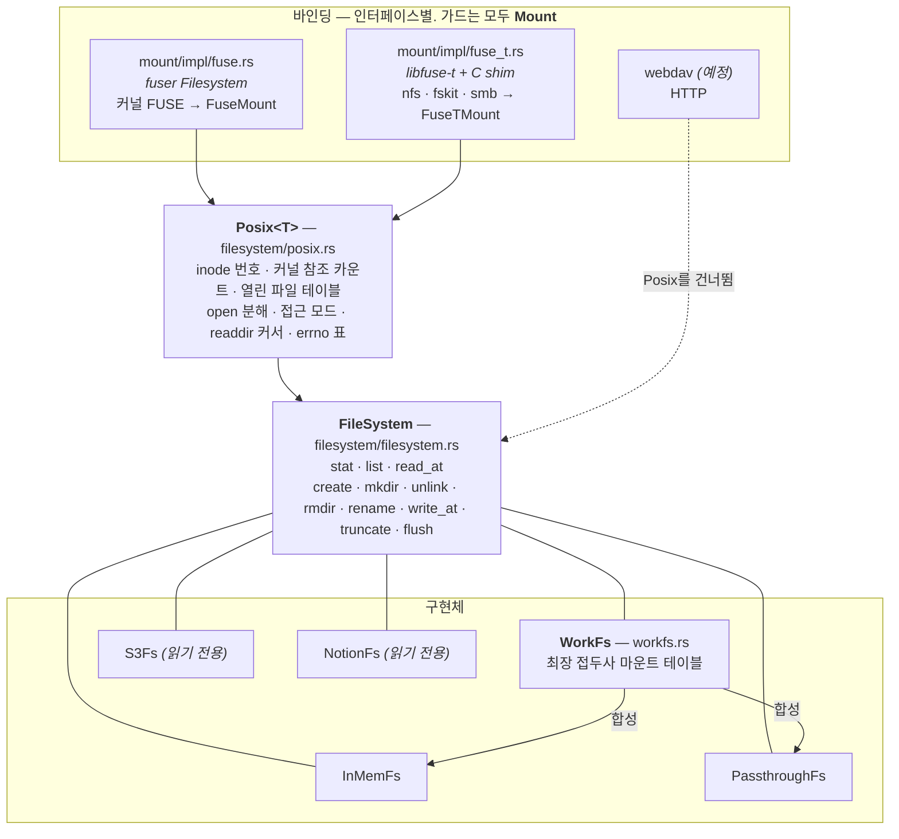

# Architecture — `fs`

`cortex::fs`는 작고 합성 가능한 가상 파일시스템입니다.

한 문장으로 요약하면 **"경로로 주소를 매기는 아무 저장소든 진짜 파일시스템으로 노출한다"**
입니다. 저장소 쪽은 [`FileSystem`](filesystem/filesystem.rs) trait 하나로 표현하고, 노출 쪽은
인터페이스마다 얇은 바인딩을 하나씩 얹습니다.

이름이 비슷한 두 trait을 먼저 갈라 두는 편이 좋습니다. **`FileSystem`은 트리를 *기술*하고,
[`Mount`](mount/mount.rs)는 OS가 실제로 마운트해 둔 *상태*입니다.** 앞쪽은 이 프로세스 안의
계약이라 밖에서는 보이지 않고, 뒤쪽은 아무 프로세스나 `open`할 수 있는 경로 하나입니다 —
바인딩이 마운트하며 돌려주는 가드가 그것이고, 가드가 drop되면 마운트도 내려갑니다.

이 크레이트의 다른 절반은 `console`입니다 — 명령을 실행하는 채널이고,
[`console/ARCHITECTURE.md`](../console/ARCHITECTURE.md)가 그쪽을 다룹니다. 둘은 서로를
모릅니다: 여기 있는 것 중 무엇도 console을 언급하지 않고, 그 반대도 마찬가지입니다.

## 계층

점선이 이 구조에서 가장 중요한 부분입니다. **`Posix`는 공통 기반이 아니라 "커널은 파일을
번호로, 그리고 디스크립터로 지칭한다"는 사실 때문에 필요한 번역 계층**입니다. 모든 동작이
경로를 들고 오는 인터페이스(WebDAV의 HTTP 메서드, 라이브러리 호출)는 그 번역이 필요 없으므로
`FileSystem`에 곧바로 닿고, `Posix`를 지나지 않습니다.

**게스트로 나가는 길은 없습니다.** microVM이 이 트리를 필요로 하면 다른 무엇과도 같은 방법으로
받습니다 — 호스트에 마운트한 뒤 디렉터리로 넘기는 것. `Posix`를 지나는 VM 모양의 두 번째 경로를
이 경로와 나란히 유지할 이유가 없습니다.

그래서 이 트리를 실제로 쓰는 쪽이 받아 드는 것은 저장소가 아니라 `Mount`입니다. `console`의
delegated executable이 그 예입니다 — 명령이 열었던 파일을 같은 이름으로 열어야 하고, 그러려면
호스트 경로가 필요합니다.

## 파일

| 파일 | 담고 있는 것 |
| --- | --- |
| [`filesystem/filesystem.rs`](filesystem/filesystem.rs) | `FileSystem` — 저장소가 구현하는 유일한 계약. `Stat`·`DirentKind`·`Dirent`가 그것이 답하는 어휘로 함께 있습니다 |
| [`filesystem/posix.rs`](filesystem/posix.rs) | `Posix<T>` — inode·파일 핸들·open 분해·errno 표. `OpenOptions`·`SetAttr`은 *호출자의* open과 커널 `setattr`의 어휘이고 여기서 멈춥니다 — 저장소는 보지 않습니다 |
| [`filesystem/impl/`](filesystem/impl/) | 구체 저장소들 |
| [`mount/mount.rs`](mount/mount.rs) | `Mount` — 가드들의 공통 계약. 바인딩이 무엇이든 마운트된 상태가 답하는 것은 이것 하나입니다 |
| [`mount/impl/`](mount/impl/) | 바인딩. 각각 가드 하나를 내보내고, `mod.rs`가 동기 콜백에서 async 저장소로 건너가는 유일한 지점(`block_on`)을 갖습니다 |
| [`workfs.rs`](workfs.rs) | `WorkFs` — 여러 저장소를 한 트리로 접합하며 그 자체로 저장소 |

## 설계 판단은 코드 옆에 있습니다

이 문서는 지도이고, *왜*는 각 항목의 doc comment가 답합니다. 특히 읽을 값이 있는 것들:

- **`FileSystem`의 `# No opens, only paths`** — 저장소에 디스크립터가 없는 이유, 그리고 경로로
  per-open 상태를 캐싱하려는 저장소가 왜 반드시 틀리는지.
- **`FileSystem`의 `# Durability`와 `# What a store answers with`** — 쓰기가 반환 시점에
  durable인 이유, `flush`가 약속이 아닌 이유, `ReadOnlyFilesystem`과 `Unsupported`를 userspace가
  다르게 취급한다는 것.
- **`Mount`의 `# A mount lives exactly as long as the value`** — 마운트 해제가 왜 `Drop`뿐인지,
  그리고 마운트를 공유(`Arc`)하는 것이 그 규칙을 약화시키지 않는 이유.
- **`Posix::unlink_child`** — unlink-while-open이 아직 없다는 것과, 그것을 되찾는 일이 왜 저장소가
  아니라 이 층의 몫인지.
- **`Posix::host_errno`** — raw errno를 넘겨도 되는 이유(같은 호스트의 번호 체계). 게스트를 읽는
  바인딩이 생기면 반대로 kind로만 분류해야 합니다 — `ENOTEMPTY`가 macOS 66, Linux 39입니다.
- **`mount/impl/fuse_t.rs`의 `FuseTBackend`** — 같은 vtable 위에서 전송만 바뀐다는 것.
